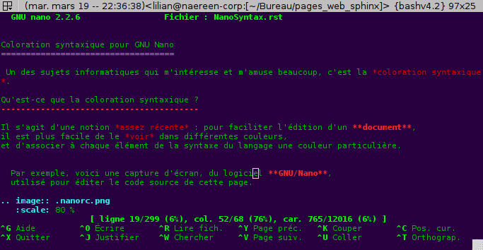
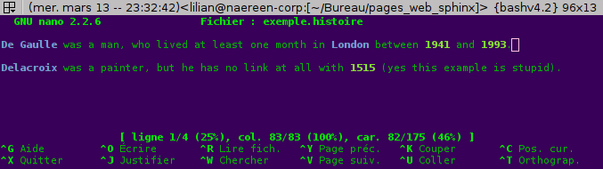
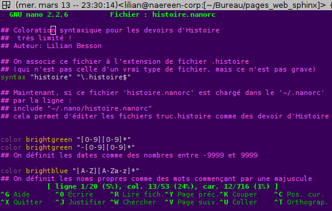

.. meta::
   :description lang=fr: Coloration syntaxique pour GNU Nano
   :description lang=en: Syntactical coloration for GNU Nano

#########################################
 Coloration syntaxique pour **GNU Nano**
#########################################
.. include:: .special.rst
.. note:: Liens directs vers les *vrais* fichiers de coloration

   Cette page est un *tutoriel*.
   Les fichiers intéressants sont dans le sous dossier `<NanoSyntax/>`_.
   
   En particulier :
   
    * `.nanorc <NanoSyntax/.nanorc>`_;
    * `reST.nanorc <NanoSyntax/reST.nanorc>`_ pour **reStructuredText** (fait entièrement par moi);
    * `caml.nanorc <NanoSyntax/caml.nanorc>`_ pour **OCaml** (amélioré);
    * `python.nanorc <NanoSyntax/python.nanorc>`_ pour **Python** (amélioré);
    * `cu.nanorc <NanoSyntax/cu.nanorc>`_ pour **CUDA** (grandement amélioré);
    
   Une archive est disponible `<nanorc.tar.bz2>`_. Elle contient tous les fichiers
   ``.nanorc`` et ``$HOME/.nanorc/*.nanorc``.

Un des sujets informatiques qui m'intéresse et m'amuse beaucoup, c'est la *coloration syntaxique*.

Qu'est-ce que la coloration syntaxique ?
----------------------------------------
Il s'agit d'une notion *assez récente* : pour faciliter l'édition d'un **document**, 
il est plus facile de le *voir* dans différentes couleurs, 
et d'associer à chaque élément de la syntaxe du langage une couleur particulière.

  Par exemple, voici une capture d'écran, du logiciel **GNU/Nano**,
  utilisé pour éditer le code source de cette page.

--------------------------------------------------------------------------------

De quoi je parle ?
~~~~~~~~~~~~~~~~~~
Imaginez que vous rédigiez un devoir d'Histoire par exemple, avec un stylo et une feuille de papier. 
Ce devoir est constitué de paragraphes, eux-mêmes rassemblés en phrase.

Et dans chaque phrase, on peut distinguer plusieurs *catégories*, plusieurs groupes de mots.
Par exemple, les dates (1941, 1515, 1993), et les noms propres (De Gaulle, Delacroix).

Voici un exemple de tel texte : ::

   De Gaulle was a man, who lived at least one month in London between 1941 and 1993.
   
   Delacroix was a painter, but he has no link at all with 1515 (yes this example is stupid).

Et bien, maintenant, tentez d'imaginer que votre feuille se mette à *colorer* 
ces différents types, ou catégories, d'une couleur différentes 
pour chaque unités de sens (ou catégories) :

 * les dates en :green:`vert`,
 * les noms propres en :purple:`mauve`.

Voici le même morceau de texte, mais un peu coloré :

.. code-block:: erlang
   
   De Gaulle was a man, who lived at least one month in London between 1941 and 1993.
   
   Delacroix was a painter, but he has no link at all with 1515 (yes this example is stupid).

**C'est ce qu'on appelle de la coloration catégoricale** (ou syntaxique).

Imaginez bien qu'un outil qui serait conçu pour colorer automatiquement vos devoirs d'Histoire 
n'aurait pas un immense dictionnaire fixé à l'avance, associant à chaque mot sa couleur, 
mais plutôt une description :

 * les noms propres sont des mots commençant par une majuscule.
 * les dates sont de la forme ``i``, ``ii`` ou ``iii`` ou ``iiii``, avec ``i`` un chiffre entre 0 et 9 (éventuellement un ``-`` devant);

Pourquoi syntaxique ?
~~~~~~~~~~~~~~~~~~~~~
Bien sûr, cela fait quelques années que je ne rédige plus de devoir d'Histoire, 
donc, me diriez-vous, quel rapport avec ce que je fais ?

Et bien voilà le détail de l'analogie précédente :

 * le *devoir* que je rédige est un **morceau de code** (aussi appelé programme) que j'écrit,
 * le stylo plume et la feuille de papier forment un **éditeur de code**,
 * la famille *devoirs d'Histoire* est un **langage informatique**,
 * les dates et les noms propres sont des catégories ou des éléments propres à ce langage.

Exemple
^^^^^^^
Par exemple, un tel *langage* peut être :
 * le langage que j'utilise pour générer cette page web, appelé ``reStructuredText``. 
 * ou le langage de la page elle même : ``HTML``.

Un exemple du paragraphe précédent, en ``reStructuredText``:

.. code-block:: rst
   
   Par exemple, un tel *langage* peut être :
   * le langage que j'utilise pour générer cette page web, appelé ``reStructuredText``. 
   * ou le langage de la page elle même : ``HTML``.

Ou le code HTML produit par `Sphinx <http://sphinx-doc.org>`_ :

.. code-block:: html
   
   <dt>Par exemple, un tel <em>langage</em> peut être :</dt>
   <dd><ul class="first last simple">
   <li>le langage que j’utilise pour générer cette page web, appelé <tt class="docutils literal">reStructuredText</tt>.</li>
   <li>ou le langage de la page elle même : <tt class="docutils literal">HTML</tt>.</li>

J'espère que ces trois exemples (source rST, code HTML produit, et rendu visuel du paragraphe), 
illustrent bien le concept de **coloration syntaxique** d'un langage de programmation.

------------------------------------------------------------------------------

Définir une telle syntaxe
~~~~~~~~~~~~~~~~~~~~~~~~~
En général, on utilise une notion venue de nos cours 
de *langages formels* : les expressions régulières (ou rationelles), 
aussi raccourci en *regexp*.

Par exemple, on peut définir :

 * les dates comme : ``[-?][0-9][0-9]*``.
   Le ``[-?]`` signifie qu'on peut mettre zéro ou un symbole ``-``.
   Le ``[0-9]`` signifie un *intervale*: un symbole entre ``0`` et ``9`` : un chiffre.
   Le ``[0-9]*`` signifie donc zéro ou un ou plus d'un chiffre (autant qu'on veut).
 * les noms propres comme ``[A-Z][a-zA-Z-']*``.
   On impose de commencer par une majuscule, 
   et ensuite on prend n'importe quelle lettre, avec un tiret ``-``, 
   ou un ``'``.

Bien sûr, ces deux définitions sommaires réalisent :

 * des faux positifs, en colorant les mots de début de phrase par exemple;
 * des faux négatifs, en oubliant de colorer les noms propres
   qui contiennent des symboles spéciaux (``ç`` ou ``é`` notamment).

Pour plus de détail, je vous renvoie à `cette page wikipédia 
<http://fr.wikipedia.org/wiki/Regexp>`_.

Comment **GNU/Nano** permet-il de définir de telles syntaxes ?
--------------------------------------------------------------
**GNU/Nano** est un éditeur assez simpliste, bien moins développé que 
**Emacs**, **Vim** ou **Eclipse**.
Et ainsi, il n'est peut être pas très approprié pour gérer des projets complets.

Mais il peut être pratique pour rapidement éditer un fichier en console.
**GNU/Nano** permet naturellement de colorer le code qu'on édite, 
comme le montre la capture d'écran en haut de *cette* page.

Et si j'ai choisi **Nano** comme exemple, c'est parce qu'il est **très facile** 
de définir une **syntaxe** pour que Nano la colore comme on le souhaite.
En fait, de tous les systèmes que auxquels j'ai touché, c'est le plus simple 
(celui de **Jota** est presque aussi simple).

Un fichier **.nanorc**
~~~~~~~~~~~~~~~~~~~~~~
Tout ce dont aura besoin **Nano** pour colorer un certain type de fichiers est un
*fichier de configuration*, avec comme extension **.nanorc** (mais ce n'est qu'une convention).

Pour l'exemple des devoir d'histoire, laissez moi vous montrer comment 
concevoir un tel fichier **histoire.nanorc**.
Le fichier complet est ici `<NanoSyntax/histoire.nanorc>`_.

Il faut d'abord définir quelle syntaxe on explique : ::

    syntax "histoire" "\.histoire$"

Le premier mot donne le nom de la syntaxe, 
et le second définit l'extension de nos devoirs d'Histoire.

Ensuite, on définit les dates comme expliqué plus haut : ::

   color brightgreen "[0-9][0-9]*"
   color brigthgreen "-[0-9][0-9]*"

On définit enfin les noms propres : ::

   color brightmagenta "[A-Z][A-Za-z]*"

Quel résultat ?
~~~~~~~~~~~~~~~
L'image suivante montre le résultat :

On a donc obtenu **exactement** ce qu'on voulait.

Il faut bien retenir la syntaxe des **.nanorc** : ::

   color une_couleur une_regexp

Les couleurs disponibles sont :blue:`blue`, :red:`red`, :green:`green`,
:yellow:`yellow`, :black:`black`, :magenta:`magenta`, :cyan:`cyan`,
:white:`white` (white) 
(traditionnelement les 8 couleurs **ANSI**, notamment utilisées dans les
terminaux ``UNIX`` et ``Linux``, cf `ANSIColors-balises 
<https://pypi.python.org/pypi/ANSIColors-balises>`_).

On peut les préfixer du mot ``bright`` pour indiquer une couleur plus claire.

On peut aussi colorer le fond, en indiquant une seconde couleur : ::

    color couleur_texte,couleur_fond une_regexp

On peut aussi utiliser la commande ``icolor`` pour capturer sans tenir compte
de la casse.

Les **regexps** utilisées suivent la syntaxe des *Perl regexps*,
un standard dans le monde Unix
(aussi utilisée par Bash pour les filtres de fichiers,
ou par *grep* pour le motif de recherche).

Une autre syntaxe possible est : ::
   
   color ma_couleur start=regexp1 end=regexp2

Pour savoir comment *charger* ce fichier ``histoire.nanorc`` au démarrage de 
**GNU/Nano**, la suite est utile.

Comment utiliser ces fichiers **.nanorc**
~~~~~~~~~~~~~~~~~~~~~~~~~~~~~~~~~~~~~~~~~
Pour les utiliser, il faut éditer le fichier ``$HOME/.nanorc``, 
qui doit contenir des lignes de la forme ``include "path/to/lang.nanorc"``.

Il est conseillé de créer un dossier ``$HOME/.nano/`` 
d'y mettre les fichiers de coloration, 
et de rajouter une ligne dans son ``$HOME.nanorc`` pour inclure chaque
fichier rajouté (ou alors d'utiliser `<NanoSyntax/.nanorc>`_).

Ainsi, dans notre exemple pour les devoirs d'Histoire, on peut copier 
le fichier ``histoire.nanorc`` dans ``$HOME/.nano``. 
Ensuite, il suffit de rajouter les deux lignes suivantes à son fichier ``$HOME/.nanorc`` : ::

    ## Pour les devoirs d'Histoire
    include "~/.nano/histoire.nanorc"

------------------------------------------------------------------------------------------------

Le dossier NanoSyntax/
----------------------
`Ce dossier <NanoSyntax/>`_ contient de nombreux fichiers pour la coloration syntaxique via **GNU Nano**, 
l'éditeur *en ligne de commande* du projet **GNU**.

`Ce fichier .nanorc <NanoSyntax/.nanorc>`_ est un bon exemple de fichier de configuration.
Le premier paragraphe fixe certaines options de **Nano**, 
comme l'utilisation du curseur, l'autorisation à suspendre l'édition (``Ctrl+Z``) etc

Fichier jouet
~~~~~~~~~~~~~
Le fichier exemple ``histoire.nanorc`` est là `<NanoSyntax/histoire.nanorc>`_.

Sources des différents fichiers
~~~~~~~~~~~~~~~~~~~~~~~~~~~~~~~
Seuls `ocaml.nanorc <NanoSyntax/ocaml.nanorc>`_, 
`reST.nanorc <NanoSyntax/reST.nanorc>`_,
`.nanorc <NanoSyntax/.nanorc>`_,
`python.nanorc <NanoSyntax/python.nanorc>`_ ont été modifiés par moi 
(ils sont sous licence GPL3, voir `<LICENSE.html>`_ pour plus d'infos). 

Pour les autres, certains viennent des fichiers installés avec le paquet **nano**.
D'autres viennent d'une collection de ``.nanorc`` trouvée sur `doc.ubuntu-fr.org <http://doc.ubuntu-fr.org>`_.
Le fichier ``octave.lang`` viens du *Wiki* officiel pour **GNU/Octave** `ici wiki.octave.org/Nano <http://wiki.octave.org/Nano>`_.
Certains fichiers sont aussi trouvables sur le dépot `github scopatz/nanorc <https://github.com/scopatz/nanorc>`_.

Python
^^^^^^
En particulier, `python.nanorc <NanoSyntax/python.nanorc>`_ a été remanié suite à la demande d'un collègue du **Cr@ns**.

reStructuredText
^^^^^^^^^^^^^^^^
En particulier, `reST.nanorc <NanoSyntax/reST.nanorc>`_ a été créé par moi 
uniquement pour ce projet (nouvelles pages web, entièrement avec **Sphinx**).
Je continue de l'améliorer chaque fois que je découvre un nouvel élément de
la syntaxe du merveilleux langage qu'est le **reStructuredText**.

STRIPS
^^^^^^
Pour mon stage, j'ai travaillé sur le modèle **STRIPS** pour la modélisation
d'un monde dynamique. J'ai utilisé ce `solveur strips <https://github.com/tansey/strips>`_.
Et j'ai créé ce fichier `strips.nanorc <NanoSyntax/strips.nanorc>`_ pour colorer
les exemples de modélisations manipulées par le solveur.

--------------------------------------------------------------------------------

Autres références
-----------------
Si ce sujet vous intéresse, je vous invite à aller jeter un oeil à ces pages là:

* `<publis/gedit-coloration/language-specs/>`_,
  le même genre de travail, pour l'éditeur **Gedit**, éditeur de code officiel du projet **GNOME**.
  De nouvelles descriptions de langages pour ``OCaml``, ``Python``, ``rST``, ``CUDA``, 
  ``scala``, ``Octave`` etc.
  Notamment, ce fichier `rst.lang <https://sites.google.com/site/naereencorp/tools/gtksourceview/rst.lang>`_,
  qui a été élaboré en même temps que `reST.nanorc <NanoSyntax/reST.nanorc>`_ pour le ``rST``.
  
* `Jota Text Editor <https://sites.google.com/site/aquamarinepandora/home/jota-text-editor/syntax>`_ 
  (et son fork `Jota + <https://play.google.com/store/apps/details?id=jp.sblo.pandora.jota.plus&hl=fr>`_)
  est le meilleur éditeur de code sur téléphone ou tablette **Android**, 
  dont j'ai réalisé une partie de la coloration syntaxique 
  (``OCaml``, ``CUDA`` ainsi que de l'aide pour ``LaTeX``, et récemment ``rST``).
  Par exemple, ce fichier `mll.mly.mli.ml.conf 
  <http://code.google.com/p/jota-text-editor/source/browse/trunk/assets/keyword/mll.mly.mli.ml.conf>`_ 
  pour la syntaxe d'``OCaml``. Et ce fichier `rst.reST.rest.conf
  <http://code.google.com/p/jota-text-editor/source/browse/trunk/assets/keyword/rst.reST.rest.conf>`_
  est pour le ``reStructuredText`` ! Il a été ajouté à Jota depuis la v0.2.31 et à Jota + depuis
  la v0.3.10 ! Jota et Jota+ ont été téléchargés plus de 6 millions de fois à eux deux !
  
* `ColorML <https://sites.google.com/site/naereencorp/liste-des-projets/colorml>`_, est
  un parseur, pretty-printer *expérimental* en ``OCaml`` pour colorer du code ``OCaml`` 
  et afficher le résultat dans un terminal. :red:`Plus maintenu, mon site googlesite est fermé.`

Me contacter
------------
Si vous avez des questions, des suggestions d'améliorations, ou des bugs 
(mauvaise coloration par exemple), n'hésitez pas à me contacter !

.. (c) Lilian Besson, 2011-2013, https://bitbucket.org/lbesson/web-sphinx/