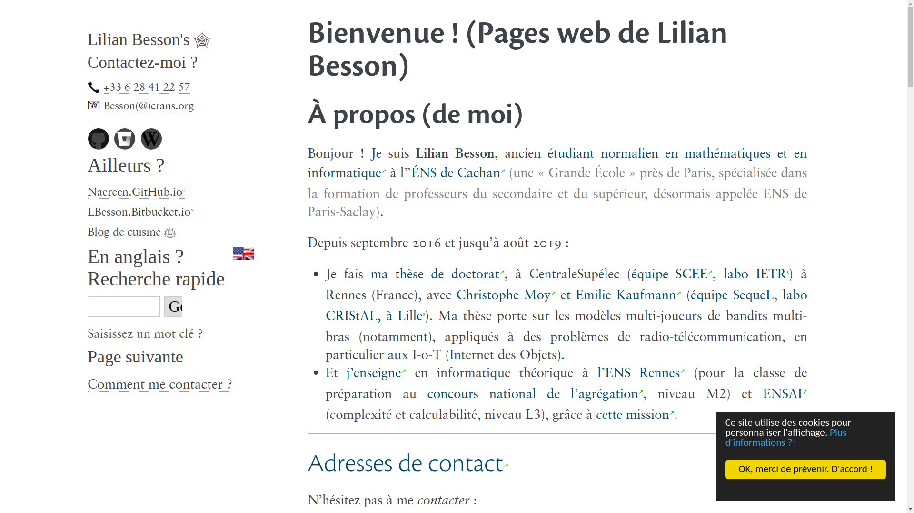

# [Lilian Besson](https://bitbucket.org/lbesson/)'s Web Pages - using Sphinx
[My web pages](http://perso.crans.org/besson/) are currently generated with [Sphinx Doc](http://sphinx-doc.org) (v*1.6+*).

I have been using [Sphinx](http://sphinx-doc.org) [since 2012](https://bitbucket.org/lbesson/web-sphinx/commits/b3a0205a3f2fe288f91e9bceb9f1ac6f6335bce3), and I like it very much!

Currently this *project* is in version *3.0*, *public* release!
I recently switched to a much cleaner theme, based on [alabaster](http://alabaster.readthedocs.io/), the new Sphinx's default theme, and nicer fonts (in Dec 2017).

## Where are those pages ?
==> On [http://perso.crans.org/besson/](<http://perso.crans.org/besson/> "Check this one !").   

## Demos
- :gb:/:us: in English:

- :fr: in French:

## What do those pages contain ?
Some pages host my résumé, others are just experiments, about Sphinx and many other things.
A few pages talk about some points I am interested in (GNU Nano, Sublime Text 3, Firefox, hitch-hiking, maths, Pokémon etc)...

## Other repository
To limit the size of this one, I used an other git repository to store the `scripts/` folder : [web-sphinx-scripts](<https://bitbucket.org/lbesson/web-sphinx-scripts/> "Hehe").

This second repository mainly hosts some Javascript scripts
(GNU Plot & OCaml & Python toplevel, `shortcuts.js`, etc),
and also a **complete** Python distribution, used with `python.opt.js` to embed a Python toplevel in my web pages (I know, it's useless, but so funny !).

----

### Author
© [Lilian Besson](http://perso.crans.org/besson/), [2011-2017](https://bitbucket.org/lbesson/web-sphinx/commits/).

### Languages
 * the [reStructuredText](http://docutils.sourceforge.net/rst.html) plain text markup language, mainly, for the content of the pages,
 * [Jinja](http://sphinx-doc.org/templating.html#jinja-sphinx-templating-primer) [templates](.templates/) (for changing appearance of the web pages),
 * [Javascript](https://en.wikipedia.org/wiki/Javascript) in the [`.static/`](.static/) folder,  for some interactive stuff on the web-pages. See [this page for some details](http://perso.crans.org/besson/js.html),
 * [CSS](https://en.wikipedia.org/wiki/CSS) in the [`.static/`](.static/) folder, for an improved style, based on the (old) default Sphinx style,
 * [HTML](https://en.wikipedia.org/wiki/HTML) (to include a few web components in some pages),
 * [Python](https://www.Python.org/) (for Sphinx configuration, [`conf.py`](conf.py) file).

----

## Requirements ?

This project use the following software:

 * [Python](https://www.Python.org/), version [2.7+](https://docs.python.org/2/) or [3.4+](https://docs.python.org/3/). 
 * [Python Sphinx](http://sphinx-doc.org) (currently v1.5+, but v1.3+ should be enough);
 * [GNU Make](https://www.gnu.org/software/make/) (other versions of Make should *NOT* work);
 * `rst2pdf`, `rst2html`, `rst2s5`, included in the [docutils package](http://docutils.sourceforge.net/), only required to build other formats, but *not* required for building basic HTML;
 * *Optional:* [LaTeX](http://www.latex-project.org/) (`pdflatex`, and `hevea`) (*not* required for building html);
 * [git](https://git-scm.com/) (but not required for building);
 * [rsync](https://rsync.samba.org/), for uploading the update pages online;
 * [GNU grep](https://www.gnu.org/software/grep/);
 * [GnuPG](https://www.gnupg.org/) (`gpg`);
 * and the following [Sphinx contrib extensions](https://bitbucket.org/birkenfeld/sphinx-contrib/), to be installed manually :

    * [autorun](https://bitbucket.org/birkenfeld/sphinx-contrib/src/default/autorun/);
    * [bitbucket](https://bitbucket.org/dhellmann/sphinxcontrib-bitbucket);
    * [cheeseshop](https://bitbucket.org/birkenfeld/sphinx-contrib/src/default/cheeseshop/);
    * [gnuplot](https://bitbucket.org/birkenfeld/sphinx-contrib/src/default/gnuplot/);
    * [youtube](https://bitbucket.org/birkenfeld/sphinx-contrib/src/default/youtube/);

 * these [Python packages, from PyPI](https://pypi.python.org/): [ansicolortags](https://pypi.python.org/pypi/ansicolortags/), [sphinx_pyreverse](https://pypi.python.org/pypi/sphinx_pyreverse/), [sphinx_git](https://pypi.python.org/pypi/sphinx_git/), [sphinx_tabs](https://pypi.python.org/pypi/sphinx_tabs/). Install them with `sudo pip install ansicolortags sphinx_pyreverse sphinx_git sphinx_tabs`;
 * *Optional:* GnuPlot (but *not* GNU Octave), only for [these embedded examples](http://perso.crans.org/besson/gnuplot_embed.html);
 * *Optional:* GraphViz and Dot graph (`dot`), only for [these embedded examples](http://perso.crans.org/besson/graph.fr.html);
 * *Optional:* Ocaml, only for [these embedded examples](http://perso.crans.org/besson/runblock.en.html#adding-support-for-another-language-ocaml).

To install all these dependencies, use [brew](https://brew.sh/) on Mac OS, or your package manager on Linux/UNIX.

## License 
This project is released under the **GPLv3 license**, for more details,
take a look at the [LICENSE file](http://perso.crans.org/besson/LICENSE.html) in the source.
© Lilian Besson, 2012-2018.

*Basically, that allow you to use all or part of the project for you own business.*

