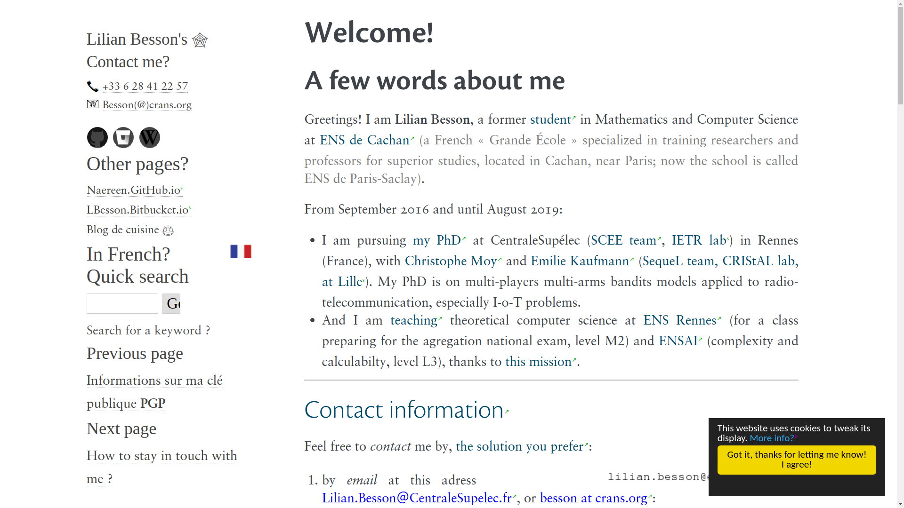

`Lilian Besson <https://bitbucket.org/lbesson/>`__\ ’s Web Pages - using Sphinx
===============================================================================

`My web pages <http://perso.crans.org/besson/>`__ are currently
generated with `Sphinx Doc <http://sphinx-doc.org>`__ (*v1.6+*).

|Website http://perso.crans.org/besson/| |Made with Python v3.6+| |Made
with Sphinx v1.6+|

I have been using `Sphinx <http://sphinx-doc.org>`__ `since
2012 <https://bitbucket.org/lbesson/web-sphinx/commits/b3a0205a3f2fe288f91e9bceb9f1ac6f6335bce3>`__,
and I like it very much!

Currently this *project* is in version *3.0*, *public* release! I
recently switched to a much cleaner theme, based on
`alabaster <http://alabaster.readthedocs.io/>`__, the new Sphinx’s
default theme, and nicer fonts (in Dec 2017).

|Maintained? Yes!| |Ask Me Anything!|

Where are those pages ?
-----------------------

⟹ On http://perso.crans.org/besson/. |Website perso.crans.org|

Demos
-----

-  🇬🇧 in English: |Screenshot demo of my web pages in English
   (1/2)|
-  🇫🇷 in French: |Screenshot demo of my web pages in French (2/2)|

What do those pages contain ?
-----------------------------

Some pages host my résumé, others are just experiments, about Sphinx and
many other things. A few pages talk about some points I am interested in
(GNU Nano, Sublime Text 3, Firefox, hitch-hiking, maths, Pokémon etc)…

Other repository
----------------

To limit the size of this one, I used an other git repository to store
the ``scripts/`` folder :
`web-sphinx-scripts <https://bitbucket.org/lbesson/web-sphinx-scripts/>`__.

This second repository mainly hosts some Javascript scripts (GNU Plot &
OCaml & Python toplevel, ``shortcuts.js``, etc), and also a **complete**
Python distribution, used with ``python.opt.js`` to embed a Python
toplevel in my web pages (I know, it’s useless, but so funny !).

--------------

Author
~~~~~~

© `Lilian Besson <http://perso.crans.org/besson/>`__,
`2011-2017 <https://bitbucket.org/lbesson/web-sphinx/commits/>`__.

Languages
~~~~~~~~~

-  the `reStructuredText <http://docutils.sourceforge.net/rst.html>`__
   plain text markup language, mainly, for the content of the pages,
-  `Jinja <http://sphinx-doc.org/templating.html#jinja-sphinx-templating-primer>`__
   `templates <.templates/>`__ (for changing appearance of the web
   pages),
-  `Javascript <https://en.wikipedia.org/wiki/Javascript>`__ in the
   ```.static/`` <.static/>`__ folder, for some interactive stuff on the
   web-pages. See `this page for some
   details <http://perso.crans.org/besson/js.html>`__,
-  `CSS <https://en.wikipedia.org/wiki/CSS>`__ in the
   ```.static/`` <.static/>`__ folder, for an improved style, based on
   the (old) default Sphinx style,
-  `HTML <https://en.wikipedia.org/wiki/HTML>`__ (to include a few web
   components in some pages),
-  `Python <https://www.Python.org/>`__ (for Sphinx configuration,
   ```conf.py`` <conf.py>`__ file).

--------------

Requirements ?
--------------

This project use the following software:

-  `Python <https://www.Python.org/>`__, version
   `2.7+ <https://docs.python.org/2/>`__ or
   `3.4+ <https://docs.python.org/3/>`__. |PyPI pyversions|
-  `Python Sphinx <http://sphinx-doc.org>`__ (currently v1.5+, but v1.3+
   should be enough);
-  `GNU Make <https://www.gnu.org/software/make/>`__ (other versions of
   Make should *NOT* work);
-  ``rst2pdf``, ``rst2html``, ``rst2s5``, included in the `docutils
   package <http://docutils.sourceforge.net/>`__, only required to build
   other formats, but *not* required for building basic HTML;
-  *Optional:* `LaTeX <http://www.latex-project.org/>`__ (``pdflatex``,
   and ``hevea``) (*not* required for building html);
-  `git <https://git-scm.com/>`__ (but not required for building);
-  `rsync <https://rsync.samba.org/>`__, for uploading the update pages
   online;
-  `GNU grep <https://www.gnu.org/software/grep/>`__;
-  `GnuPG <https://www.gnupg.org/>`__ (``gpg``);
-  and the following `Sphinx contrib
   extensions <https://bitbucket.org/birkenfeld/sphinx-contrib/>`__ (now living on `this GitHub repo <https://github.com/thewtex/sphinx-contrib>`_), to
   be installed manually :

   -  `autorun <https://bitbucket.org/birkenfeld/sphinx-contrib/src/default/autorun/>`__;
   -  `bitbucket <https://bitbucket.org/dhellmann/sphinxcontrib-bitbucket>`__;
   -  `cheeseshop <https://bitbucket.org/birkenfeld/sphinx-contrib/src/default/cheeseshop/>`__;
   -  `gnuplot <https://bitbucket.org/birkenfeld/sphinx-contrib/src/default/gnuplot/>`__;
   -  `youtube <https://bitbucket.org/birkenfeld/sphinx-contrib/src/default/youtube/>`__;

-  these `Python packages, from PyPI <https://pypi.python.org/>`__:
   `ansicolortags <https://pypi.python.org/pypi/ansicolortags/>`__,
   `sphinx_pyreverse <https://pypi.python.org/pypi/sphinx_pyreverse/>`__,
   `sphinx_git <https://pypi.python.org/pypi/sphinx_git/>`__,
   `sphinx_tabs <https://pypi.python.org/pypi/sphinx_tabs/>`__. Install
   them with
   ``sudo pip install ansicolortags sphinx_pyreverse sphinx_git sphinx_tabs``;
-  *Optional:* GnuPlot (but *not* GNU Octave), only for `these embedded
   examples <http://perso.crans.org/besson/gnuplot_embed.html>`__;
-  *Optional:* GraphViz and Dot graph (``dot``), only for `these
   embedded examples <http://perso.crans.org/besson/graph.fr.html>`__;
-  *Optional:* Ocaml, only for `these embedded
   examples <http://perso.crans.org/besson/runblock.en.html#adding-support-for-another-language-ocaml>`__.

To install all these dependencies, use `brew <https://brew.sh/>`__ on
Mac OS, or your package manager on Linux/UNIX.

License |GPLv3 license|
-----------------------

This project is released under the **GPLv3 license**, for more details,
take a look at the `LICENSE
file <http://perso.crans.org/besson/LICENSE.html>`__ in the source. ©
Lilian Besson, 2012-2018.

*Basically, that allow you to use all or part of the project for you own
business.*

|ForTheBadge built-with-love| |Analytics|

|ForTheBadge uses-badges| |ForTheBadge uses-git| |ForTheBadge uses-html|
|ForTheBadge uses-css| |ForTheBadge uses-js|

.. |Website http://perso.crans.org/besson/| image:: https://img.shields.io/website-up-down-green-red/http/perso.crans.org.svg
   :target: http://perso.crans.org/besson/
.. |Made with Python v3.6+| image:: https://img.shields.io/badge/Made%20with-Python-1f425f.svg
   :target: https://www.python.org/
.. |Made with Sphinx v1.6+| image:: https://img.shields.io/badge/Made%20with-Sphinx-1f425f.svg
   :target: http://sphinx-doc.org/
.. |Maintained? Yes!| image:: https://img.shields.io/badge/Maintained%3F-yes-green.svg
   :target: https://bitbucket.org/lbesson/web-sphinx/commits/
.. |Ask Me Anything!| image:: https://img.shields.io/badge/Ask%20me-anything-1abc9c.svg
   :target: https://bitbucket.org/lbesson/ama
.. |Website perso.crans.org| image:: https://img.shields.io/website-up-down-green-red/http/perso.crans.org.svg
   :target: http://perso.crans.org/

.. |Screenshot demo of my web pages in French (2/2)| image:: demo_fr.png
.. |PyPI pyversions| image:: https://img.shields.io/pypi/pyversions/ansicolortags.svg
   :target: https://pypi.python.org/pypi/ansicolortags/
.. |GPLv3 license| image:: https://img.shields.io/badge/License-GPLv3-blue.svg
   :target: http://perso.crans.org/besson/LICENSE.html
.. |ForTheBadge built-with-love| image:: http://ForTheBadge.com/images/badges/built-with-love.svg
   :target: https://bitbucket.org/lbesson/web-sphinx/commits/
.. |Analytics| image:: https://ga-beacon.appspot.com/UA-38514290-17/bitbucket.org/lbesson/web-sphinx/README.md?pixel
   :target: https://bitbucket.org/lbesson/web-sphinx
.. |ForTheBadge uses-badges| image:: http://ForTheBadge.com/images/badges/uses-badges.svg
   :target: http://ForTheBadge.com
.. |ForTheBadge uses-git| image:: http://ForTheBadge.com/images/badges/uses-git.svg
   :target: https://bitbucket.org/lbesson
.. |ForTheBadge uses-html| image:: http://ForTheBadge.com/images/badges/uses-html.svg
   :target: http://ForTheBadge.com
.. |ForTheBadge uses-css| image:: http://ForTheBadge.com/images/badges/uses-css.svg
   :target: http://ForTheBadge.com
.. |ForTheBadge uses-js| image:: http://ForTheBadge.com/images/badges/uses-js.svg
   :target: http://ForTheBadge.com
