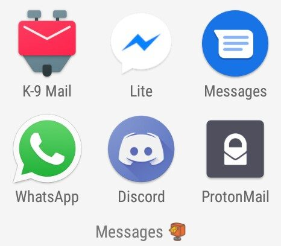
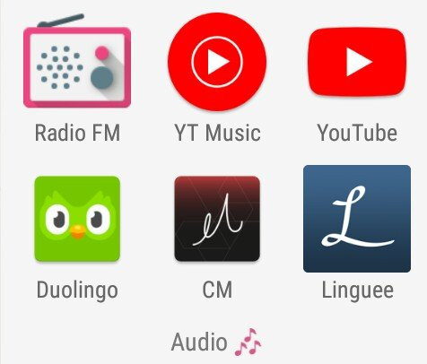
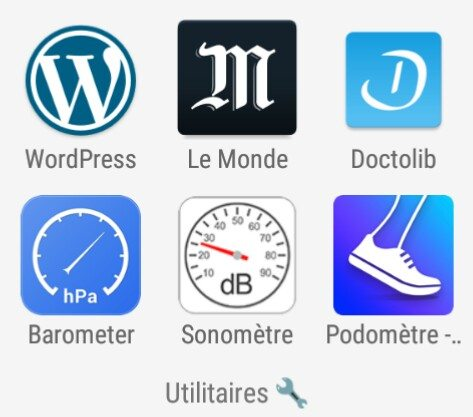
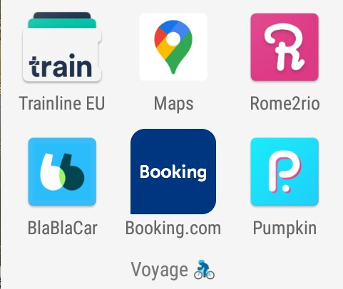
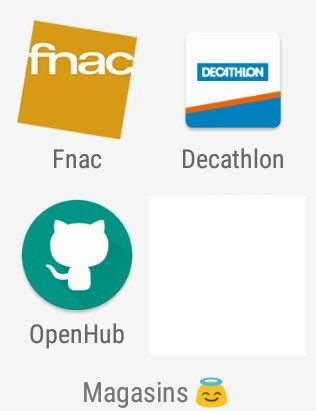
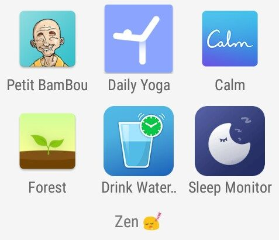
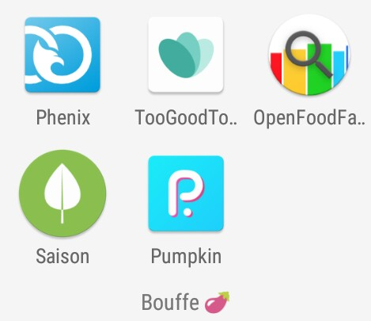
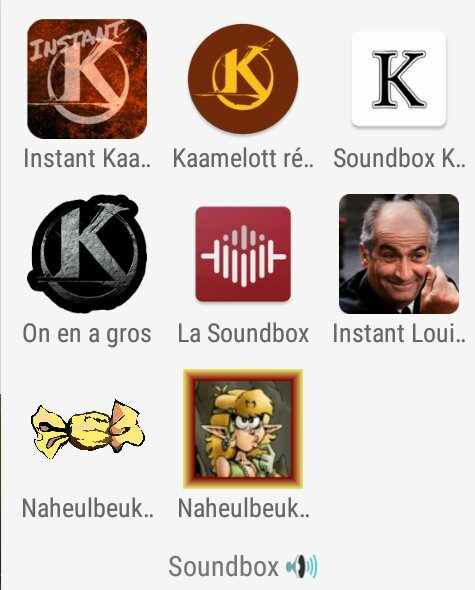

.. meta::
   :description lang=en: Android™ applications "for the confinement" in 2020
   :description lang=fr: Applications Android™ "spéciale confinement" en 2020

#####################################################
 Android™ applications "for the confinement" in 2020
#####################################################

The list of applications given here corresponds to the applications I have installed on my (two) Android™ smartphones in 2020, and that I opened and used every day during the `coronavirus containment` (at least one month).

I list them by categories, following the categories already used on my phones.

.. note:: This page is about applications for Android™

   For more details, it may be useful to go elsewhere for more information:

    * for example at `en.wikipedia.org/wiki/Android <https://fr.wikipedia.org/wiki/Android>`_,
    * or at `www.cnetfrance.fr/Android/ <https://www.cnetfrance.fr/Android/>`_.

Messages
~~~~~~~~

- 📧 🐕 K-9 Mail: the best mail client I know ``#chien`` ``#mail`` ;
- 📧 `Messenger lite <https://www.Messenger.com/>`_ (*lite* version which is more than enough) ``#messenger`` ;
- 📧 `Facebook lite <https://www.Facebook.com/>`_ (*lite* version which is more than enough) ``#fb`` ;
- 📧 `WhatsApp <https://www.WhatsApp.com/>`_ ``#WhatsApp`` ;
- 💿 🎮 `Discord <https://www.DiscordApp.com/>`_ : my colleagues and I use Discord to `continue our teaching activites learning (during the coronavirus epidemic) <coronavirus.html>` ``#dvd`` ``#discord`` ``#gaming`` ``#geek`` ;
- 🇨🇭 `ProtonMail <https://www.ProtonMail.com/>`_: best encrypted mail (free, Swiss, reliable) ``#suisse`` (my ProtonMail address is ``firstname.lastname@ProtonMail.com``).

Meeting people
~~~~~~~~~~~~~~

- 🛋 🏄 `CouchSurfing <https://www.CouchSurfing.com/>`_: I use it to lodge people in my home, and to get people to lodge me in other people's homes, when I travel ``#couch`` ``#canape`` ``#surf``;
- 👻 `SnapChat <https://www.OkCupid.com/>`_: to play "spies" with your friends ``#ghost`` ``#snap``;

.. sidebar:: Might be out of date!

   I wrote this list in *April 2020*, so it might  be obsolete...

Audio
~~~~~

- FM radio: to listen (with headphones);
- `YouTube <https://www.YouTube.com/>`_ of course;
- `YouTube Music <https://music.YouTube.com/>`_: to listen to unlimited music in streaming (with a subscription, at 10€ per month, and free one to four months);
- Tape recorder: to record sound with your phone in one click. Very handy to record a bird and try to find its name after (e.g., a chicken) ;
- `Duolingo <https://www.DuoLingo.com/>`_ : to learn another language! In confinement, nothing like 20 minutes every day to learn Portuguese, for example!
- CM (Classic Music) : hundreds of free classical music pieces that can be listened to in one click (in streaming).

Useful apps
~~~~~~~~~~~

To use websites easily on mobile (registered account, easy to use) :

- `WordPress <https://www.WordPress.com/>`_ : to manage a blog under WordPress, e.g., `Actuel Moyen-Âge <https://ActuelMoyenAge.WordPress.com/>`_ ;
- `LeMonde <https://www.LeMonde.fr/>`_ for current events (in France). I think it is essential to read the news quickly in the morning on AT LEAST ONE digital newspaper.

.. sidebar:: Other languages?

   I also read `The Times <https://www.times.co.uk/>`_, `The NY Times <https://www.nytimes.com/>`_, `The Guardian <https://www.TheGuardian.com/>`_ and `El Pais <https://www.ElPais.com/>`_ in Spanish.

- `Doctolib <https://www.Doctolib.fr/>`_ to make an appointment with one's health practitioners (doctor, dentist, etc);

Three tiny applications, just to access a phone sensor:

- **Barometer**: with the help of the Internet, and the possible internal sensor, gives the current pressure (useful for predicting the weather);
- **Sonometer**: current volume, very well done!
- **Pedometer**: any good application will do it. If you have a "connected watch" it can talk to the application!

And finally:

- Your favorite app that offers a **VPN** (e.g., **NordVPN**);
- Your favorite weather app;
- `Language <https://www.Linguee.com/>`_: online dictionary.

.. sidebar:: What is an application?

   An application (*app*) is a program for a laptop, a tablet or a smartphone powered by the **Android™** OS.

   These programs are distributed as compressed archives,
   with the ``apk`` format, which means "*Application PacKage*",
   as the *EXEcutable* program for **Windows™** with the ``.exe`` format,
   or the *Disk iMaGe* for **Mac OS X™** with the ``.dmg`` format.

To (not) travel
~~~~~~~~~~~~~~~

To use websites easily on mobile (registered account, easy to use) :

- `Trainline EU <https://www.Trainline.fr/>`_ to book and pay (and keep) train tickets. Now works in the (western) half of Europe!
- `(Google) Maps <https://maps.Google.com/>`_ to calculate routes and locate yourself. I also suggest Waze for car routes.

.. sidebar:: An open-source, free alternative to Google Maps ?

   In addition to being free and open source, `OpenStreetMap <https://www.openstreetmap.org/>`_ is created and managed by the community.
   With `OSM And <https://osmand.net/>`_ you can download maps in advance and access them easily without an internet connection.

- `Rome2rio <https://www.Rome2rio.com/>`_ to calculate routes that mix train, car, plane, etc.. Very reliable, very efficient everywhere in Europe, I don't know about the rest of the world. In France, it knows bus and train timetables better than Google Maps!
- `BlaBlaCar <https://www.BlaBlaCar.fr/>`_ to book and manage his carpool trips with the most popular platform in France (several million users) ;
- `Booking.com <https://www.Booking.com/>`_ to book accommodation, whether rental apartments (like AirBNB), hotels, etc. If you want to become a customer, use this link : FIXME.

Online stores
~~~~~~~~~~~~~

To use websites easily on mobile (registered account, easy to use) :

- `Fnac <https://www.Fnac.com/>`_;
- `The GoodCoin <https://www.LeBonCoin.fr/>`_ ;
- `GitHub <https://GitHub.com/>`_;
- your bank's app (e.g., La Banque Postale, BNP PariBas, etc).

To relax
~~~~~~~~

- **Petit Bamboo** : to initiate yourself to meditation;
- **Daily Yoga**: to learn yoga;
- **Calm**: to help daily meditation, and offers free ambient sounds like forest or birds;
- **Forest**: to help disconnect from your phone;
- **Drink Water Reminder**: super simple but effective;
- **Sleep Monitor**: suggests to go to sleep in the evening, effective alarm (soft but persistent) in the morning... The app also offers very precise statistics, if you think about indicating the beginning and end of sleep ;
- Bonus: the website `Generative.fm <https://Generative.fm/>`_ offers dozens of pieces of background music, random, composed by... programs (neural networks and everything)! It's ideal for work, I love it !

For food
~~~~~~~~

Two very similar applications, which propose in large cities to recover lunch baskets or other that will be thrown away:

- **Phoenix App**;
- **TooGoodToGo**.

Other apps :

- **OpenFoodFacts** gives a lot of curious information about all kinds of food products;
- **Season** to know the fruits and vegetables in season;
- **Pumpkin** to pay his friends, I use it because it is used by the association at the ENS in Rennes which manages the AMAP.

*Soundboxes* to have fun
~~~~~~~~~~~~~~~~~~~~~~~~

- Instant Kaamelott
- Kaamelott replicas & GIF
- Soundbox Kaamelott
- We got a lot of them.
- **The Soundbox** is by far the best, because it contains a lot of cult movies!
- Instant Louis de Funès
- Naheulbeuk Chiantos Box
- **Naheulbeuk MP3** is great, download the episodes on the fly from `the Naheulbeuk website (penofchaos.fr/donjon) <http://penofchaos.fr/donjon/>`_.

.. (c) Lilian Besson, 2011-2020, https://bitbucket.org/lbesson/web-sphinx/
