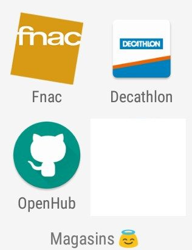

.. meta::
   :description lang=fr: Applications Android™ "spéciale confinement" en 2020
   :description lang=en: Android™ applications "for the confinement" in 2020

######################################################
 Applications Android™ "spéciale confinement" en 2020
######################################################

La liste d'application donnée ici correspond aux applications que j'ai installées sur mes deux téléphones "intelligents" (sous Android™) en 2020, et que j'ai ouvert et utilisé chaque jour durant `le confinement lié au coronavirus <coronavirus.fr.html>`_ (au moins un mois).

Je les liste par catégories, en suivant les catégories déjà utilisées sur mes téléphones.

.. sidebar:: Cette page parle d'applications pour Android™

   Pour plus de détails, il peut être utile d'aller s'informer ailleurs :

    * par exemple sur `fr.wikipedia.org/wiki/Android <https://fr.wikipedia.org/wiki/Android>`_,
    * ou sur `www.cnetfrance.fr/Android/ <https://www.cnetfrance.fr/Android/>`_.

Messages
~~~~~~~~

.. image:: .apk-list-messages.jpg
   :scale: 80%
   :align: right
   :alt: List of apps related to Messages
   :target: https://www.Messenger.com/

- K-9 Mail : le meilleur client mail que je connaisse ;
- `Messenger lite <https://www.Messenger.com/>`_ (version *lite* qui suffit largement) ;
- `Facebook lite <https://www.Facebook.com/>`_ (version *lite* qui suffit largement) ;
- `WhatsApp <https://www.WhatsApp.com/>`_ ;
- `Discord <https://www.DiscordApp.com/>`_ : mes collègues et moi-même nous servons de Discord pour `nos enseignements à distance (durant l'épidémie de coronavirus) <coronavirus.fr.html>`_ ;
- `ProtonMail <https://www.ProtonMail.com/>`_ : meilleur mail chiffré (gratuit, Suisse, fiable).

Rencontres
~~~~~~~~~~

- `CouchSurfing <https://www.CouchSurfing.com/>`_ : je m'en sers pour héberger des gens chez moi, et pour me faire héberger chez d'autres gens, quand je voyage ;
- `SnapChat <https://www.SnapChat.com/>`_ : pour jouer aux espions avec ses amis ;
- `OkCupid <https://www.OkCupid.com/>`_ : il y a pas beaucoup de gens, mais des gens intelligents et sympa ;
- `Tinder <https://www.Tinder.com/>`_ : il y a beaucoup de gens, et peu de gens qui répondent ensuite aux conversations ;
- `Happn <https://www.Happn.com/>`_ : je n'aime pas vraiment, il y a pas mal de gens mais personne ne répond ;
- `Once <https://www.Once.com/>`_ : je n'aime vraiment pas.

.. sidebar:: N'est peut-être plus à jour !

   J'ai écrit cette liste en *avril 2020*, donc elle est peut-être obsolète…

Audio
~~~~~

.. image:: .apk-list-audio.jpg
   :scale: 80%
   :align: right
   :alt: List of apps related to audio
   :target: https://www.YouTube.com/

- Radio FM : pour écouter (avec un casque) ;
- `YouTube <https://www.YouTube.com/>`_ : évidemment ;
- `YouTube Music <https://music.YouTube.com/>`_ : pour écouter de la musique en illimité en streaming (avec un abonnement, à 10€ par mois, et gratuit un à quatre mois) ;
- Magnétophone : pour enregistrer en un clic du son avec son téléphone. Très pratique pour enregistrer un oiseau et essayer de retrouver son nom après (e.g., un poulet) ;
- `Duolingo <https://www.DuoLingo.com/>`_ : pour apprendre une autre langue ! En confinement, rien de tel que 20 minutes chaque jour pour apprendre le portugais, par exemple !
- CM (Classic Music) : des centaines de morceaux de musique classique gratuit et écoutable en un clic (en streaming).

Utilitaires
~~~~~~~~~~~

.. image:: .apk-list-daily_useful_apps.jpg
   :scale: 80%
   :align: right
   :alt: List of daily useful apps
   :target: https://www.WordPress.com/

Pour utiliser des sites web facilement sur mobile (compte enregistré, utilisation facilitée) :

- `WordPress <https://www.WordPress.com/>`_ : pour gérer un blogue sous WordPress (e.g., `Actuel Moyen-Âge <https://ActuelMoyenAge.WordPress.com/>`_, `Rennes en Résilience <https://RennesenResilience.WordPress.com/>`_) ;
- `LeMonde <https://www.LeMonde.fr/>`_ pour l'actualité. Je pense qu'il est essentiel de lire rapidement l'actualité le matin sur AU MOINS UN journal numérique ;
- `Doctolib <https://www.Doctolib.fr/>`_ pour prendre rendez-vous chez ses practicien-ne-s de santé (médecin, dentiste, etc) ;

Trois applications minuscules, juste pour avoir accès à un capteur du téléphone :

- **Barometer** : avec l'aide d'Internet, et l'éventuel capteur interne, donne la pression actuelle (utile pour prédire la météo) ;
- **Sonomètre** : volume sonore actuel, très bien faite !
- **Podomètre** : n'importe quelle bonne application le fera. Si vous avez une "montre connectée" elle peut parler à l'application !

Et enfin :

- Votre application favorite proposant un **VPN** (e.g., **NordVPN**) ;
- Votre application favorite de **météo** ;
- `Linguee <https://www.Linguee.com/>`_ : dictionnaire en ligne.

.. sidebar:: Qu'est-ce qu'une application ?

   Une application (*app*) est un programme pour un ordinateur, une tablette ou un téléphone fonctionnant avec le système d'exploitation Android™.

   Ces programmes sont distribués sous forme d'archives compressées,
   au format ``apk``, qui signifie "*Application PacKage*",
   un peu à la manière d'un *EXEcutable* Windows sous le format ``.exe``,
   ou d'un *Disk iMaGe* pour Mac OS X sous le format ``.dmg``.

Pour (ne pas) voyager
~~~~~~~~~~~~~~~~~~~~~

.. image:: .apk-list-travel.jpg
   :scale: 80%
   :align: right
   :alt: List of apps related to travel
   :target: https://www.Trainline.fr/

Pour utiliser des sites web facilement sur mobile (compte enregistré, utilisation facilitée) :

- `Trainline EU <https://www.Trainline.fr/>`_ pour réserver et payer (et conserver) ses billets de train. Fonctionne désormais dans la moitié (ouest) de l'Europe !
- `(Google) Maps <https://maps.Google.com/>`_ pour calculer des itinéraires et se localiser. Je suggère aussi Waze pour les itinéraires en voiture.

.. sidebar:: Une alternative libre, gratuite à Google Maps ?

   En plus d'être libre et gratuite, `OpenStreetMap <https://www.openstreetmap.org/>`_ est créée et gérée par la communauté.
   Avec `OSM And <https://osmand.net/>`_, on peut télécharger à l'avance les cartes et y accéder facilement sans connexion à Internet.

- `Rome2rio <https://www.Rome2rio.com/>`_ pour calculer des itinéraires qui mélangent train, voiture, avion, etc. Très fiable, très efficace partout en Europe, je ne sais pas pour le reste du monde. En France, il connaît les horaires de bus et de train mieux que Google Maps !
- `BlaBlaCar <https://www.BlaBlaCar.fr/>`_ pour réserver et gérer ses trajets de covoiturage avec la plateforme la plus populaire en France (plusieurs millions d'utilisatrices) ;
- `Booking.com <https://www.Booking.com/>`_ pour réserver des logements, que ce soit appartements de location (comme AirBNB), des hôtels, etc. Je peux vous paraîner si vous voulez devenir client, utilisez ce lien : FIXME.

Magasins en ligne
~~~~~~~~~~~~~~~~~

Pour utiliser des sites web facilement sur mobile (compte enregistré, utilisation facilitée) :

- `Fnac <https://www.Fnac.com/>`_ ;
- `LeBonCoin <https://www.LeBonCoin.fr/>`_ ;
- `GitHub <https://GitHub.com/>`_ ;
- l'appli de votre banque (e.g., La Banque Postale, BNP PariBas, etc) .

Pour se détendre
~~~~~~~~~~~~~~~~

.. image:: .apk-list-zen.jpg
   :scale: 80%
   :align: right
   :alt: List of apps related to zen activities
   :target: https://Generative.fm/

- **Petit Bambou** : pour s'initier à la méditation ;
- **Daily Yoga** : pour s'initier au yoga ;
- **Calm** : pour aider la méditation quotidienne, et propose gratuitement des bruits d'ambiance style forêt ou oiseaux ;
- **Forest** : pour aider à déconnecter de son téléphone ;
- **Drink Water** Reminer : super simple mais efficace ;
- **Sleep Monitor** : suggère d'aller dormir le soir, alarme efficace (douce mais persistante) le matin... L'appli propose aussi des statistiques très précises, si on pense à lui indiquer les débuts et fin de sommeil ;
- Bonus : le site web `Generative.fm <https://Generative.fm/>`_ propose des dizaines de morceaux de musique d'ambiance, alétaoires, composées par... des programmes (réseaux de neurones et tout) ! C'est idéal pour travailler, j'adore !

Pour l'alimentation
~~~~~~~~~~~~~~~~~~~

.. image:: .apk-list-food.jpg
   :scale: 80%
   :align: right
   :alt: List of apps related to food
   :target: https://www.TooGoodToGo.com/

Deux applications très similaires, qui proposent dans les grandes villes de récupérer des paniers repas ou autre qui vont être jetés :

- **Phénix App** ;
- **TooGoodToGo**.

D'autres applications :

- **OpenFoodFacts** donne plein d'informations curieuses sur tous types de produits d'alimentation ;
- **Saison** pour connaître les fruits et légumes de saison ;
- **Pumpkin** pour payer auprès de ses amis, je m'en sers car elle est utilisée par l'association à l'ENS de Rennes qui gère l'AMAP.

Boîtes à son pour rigoler
~~~~~~~~~~~~~~~~~~~~~~~~~

.. image:: .apk-list-soundboxes.jpg
   :scale: 80%
   :align: right
   :alt: List of apps related to soundboxes

- Instant Kaamelott
- Kaamelott répliques & GIF
- Soundbox Kaamelott
- On en a gros
- **La Soundbox** est de loin la meilleure, car contient plein de films culte !
- Instant Louis de Funès
- Naheulbeuk Boîte à Chiantos
- **Naheulbeuk MP3** est chouette, télécharge à la volée les épisodes depuis `le site web de Naheulbeuk (penofchaos.fr/donjon) <http://penofchaos.fr/donjon/>`_.

Pour faire croire qu'on est encore en prépa
~~~~~~~~~~~~~~~~~~~~~~~~~~~~~~~~~~~~~~~~~~~

- **Banque Exo (MP CCP)**
- **ExoSupSpé**
- **OCaml Toplevel for Android**

.. todo:: Écrire une page spéciale, sur ReR/blog/ avec des captures d'écran etc !

.. (c) Lilian Besson, 2011-2020, https://bitbucket.org/lbesson/web-sphinx/
