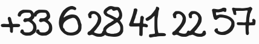

.. meta::
   :description lang=fr: Pages personnelles de Lilian Besson sur le web
   :description lang=en: Lilian Besson's personal web pages

##########################################
 Bienvenue ! (Pages web de Lilian Besson)
##########################################

À propos (de moi)
-----------------
Bonjour !
Je suis **Lilian Besson**, ancien `étudiant normalien en mathématiques et en informatique <http://www.math.ens-cachan.fr/version-francaise/haut-de-page/annuaire/besson-lilian-128754.kjsp>`_
à |ENSCachan|.

.. |ENSCachan| raw:: html

  <abbr title="L'ENS de Cachan est une « Grande École » près de Paris, spécialisée dans la formation de professeurs du secondaire et du supérieur, désormais appelée ENS de Paris-Saclay"><a href='http://www.ens-cachan.fr/version-anglaise/'>l'ENS de Cachan</a></abbr>

Depuis septembre 2016 et jusqu'en août 2019 :

- Je fais `ma thèse de doctorat <phd/>`_, à CentraleSupélec (`équipe SCEE <http://www-scee.rennes.supelec.fr/wp/>`_, `labo IETR <https://www.ietr.fr/spip.php?auteur1069>`_) à Rennes (France), avec `Christophe Moy <http://www.rennes.supelec.fr/ren/perso/cmoy/recherche.php>`_ et `Emilie Kaufmann <http://chercheurs.lille.inria.fr/ekaufman/research.html>`_ (`équipe SequeL, labo CRIStAL, à Lille <https://team.inria.fr/sequel/team-members/>`_). Ma thèse porte sur les modèles multi-joueurs de bandits multi-bras (notamment), appliqués à des problèmes de radio-télécommunication, en particulier aux I-o-T (Internet des Objets).
- Et `j'enseigne <enseignement.fr.html>`_ en informatique théorique à `l'ENS Rennes <http://www.dit.ens-rennes.fr/agregation-option-d/>`_ (pour la classe de préparation au `concours national de l'agrégation <http://agreg.org/>`_, niveau M2) et `ENSAI <http://www.ensai.fr/formation/id-1re-annee.html>`_ (complexité et calculabilité, niveau L3), grâce à `cette mission <http://www.irisa.fr/fr/emplois/enseignants/missions-denseignement-au-departement-informatique-lens-rennes>`_.

------------------------------------------------------------------------------

`Adresses de contact <callme.fr.html>`_
^^^^^^^^^^^^^^^^^^^^^^^^^^^^^^^^^^^^^^^
N'hésitez pas à me *contacter* :

.. image:: .courriel.png
    :scale: 40 %
    :align: right
    :alt:   Mon adresse courriel, dans une image PNG…
    :target: mailto:Lilian.Besson＠CentraleSupelec.fr

#. par *courriel* à cette adresse `Lilian.Besson＠CentraleSupelec.fr <mailto:Lilian.Besson＠CentraleSupelec.fr>`_, ou `besson à crans.org <mailto:besson à crans.org>`_ :

#. ou par téléphone :

#. … et `plus de moyens de me contacter sont présentés ici <callme.fr.html>`_.

------------------------------------------------------------------------------

Les deux dernières années (2016-18)
^^^^^^^^^^^^^^^^^^^^^^^^^^^^^^^^^^^
* J'ai commencé ma thèse de doctorat. Lisez `cette page là <https://perso.Crans.org/besson/me/index.fr.html>`_ pour plus de détails.

En *2015-16*
^^^^^^^^^^^^
* J'étais `stagiaire en recherche <https://people.epfl.ch/lilian.besson>`_ dans l'`équipe LIB <http://bigwww.epfl.ch/people.html>`_ à l'`EPFL (Lausanne, Suisse) <http://www.epfl.ch/>`_, entre avril et août 2016, sous la direction de `Julien Fageot <http://bigwww.epfl.ch/fageot/index.html>`_ et `Michael Unser <http://bigwww.epfl.ch/unser/>`_. Allez voir `le dépôt git pour mon stage <https://bitbucket.org/lbesson/internship-mva-2016>`_ (mon `mémoire de master <https://goo.gl/xPzw4A>`_ est terminé) !

* J'ai obtenu le `master MVA <http://www.math.ens-cachan.fr/version-francaise/formations/master-mva/>`_ (à l'`ÉNS de Cachan`_), un master en maths appliquées, spécialisé en `apprentissage statistique <https://fr.wikipedia.org/wiki/Apprentissage_automatique>`_ et en `optimisation numérique <https://fr.wikipedia.org/wiki/Optimisation_(mathématiques)>`_. Cf. `mes documents produits pour le MVA <./publis/mva-2016/>`_, et `6 projets <https://bitbucket.org/lbesson/profile/repositories?search=MVA>`_ : `PCS <http://lbesson.bitbucket.io/pcs2016>`_, `PGM <http://lbesson.bitbucket.io/pgm2016>`_, `RL / GML <http://lbesson.bitbucket.io/gml2016>`_, `Kernel <http://lbesson.bitbucket.io/kernel2016>`_, `Brain Imaging <http://lbesson.bitbucket.io/brain2016>`_, `Neuro-Sciences <http://lbesson.bitbucket.io/neuro2016>`_. J'ai *majoré* le master MVA en 2015-16, avec 13 cours et la note finale de **18.43 / 20** (`"très bien avec félicitations du jury" <https://fr.wikipedia.org/wiki/Mention_honorifique>`_).

* J'étais aussi `colleur en maths <enseignement.fr.html>`_ et `chargé de TD en informatique <infoMP/>`_ en classe prépa' MP, au `Lycée Lakanal <http://www.lyc-lakanal-sceaux.ac-versailles.fr/>`_ à Sceaux.

Études et cursus
^^^^^^^^^^^^^^^^
* Entre mi-juillet 2014 et mi-mai 2015, **j'ai vécu et travaillé en Inde** deux semestres, `sur le campus <https://goo.gl/maps/CcL2c>`_ de la `toute nouvelle <http://goo.gl/0lecQw>`_ `Mahindra École Centrale <http://www.mahindraecolecentrale.edu.in/>`_. J'ai travaillé en tant que chargé de `Travaux Dirigés <https://fr.wikipedia.org/wiki/Travaux_dirig%C3%A9s>`_ en mathématiques (`MA101 <./ma101/>`_ et `MA102 <./ma102/>`_), et j'étais surtout en charge du cours d'*introduction à l'informatique* (`CS101 <./cs101/>`_) pour le second semestre (janvier -- mai 2015), `en tant que "Teaching Assistant" <http://web.archive.org/web/20150314101201/http://mahindraecolecentrale.edu.in/faculty.php?fid=26>`_.

* En 2013/2014, j'ai `préparé <http://www.math.ens-cachan.fr/version-francaise/formations/preparation-a-l-agregation/>`_ et obtenu un `Master de Formation des Enseignants du Supérieur <http://www.universite-paris-saclay.fr/fr/formation/master/m2-formation-a-lenseignement-superieur-en-mathematiques-cachan>`_ (**M2 FESup**) à l'ÉNS Cachan (avec mention *Très Bien*), ainsi que l'`agrégation de Mathématiques <https://fr.wikipedia.org/wiki/Agr%C3%A9gation_de_math%C3%A9matiques>`_, (en option "D" *informatique*), `classé 23ème <http://web.archive.org/web/20140709144720/agreg.org/ResultatsMerite2014.html>`_. `Mes développements et mes références sont là <agreg-2014/index.html>`_.

* En 2012/2013, j'ai obtenu deux **M1** (première année de master): pour le `MPRI <https://wikimpri.dptinfo.ens-cachan.fr/doku.php?id=start>`_ (master de recherche en informatique de Paris),
  et le `master Hadamard de mathématiques fondamentales <http://www.math.ens-cachan.fr/version-francaise/formations/formation-en-mathematiques-de-l-ens-cachan-ex-magistere-/2eme-annee-le-m1-hadamard/>`_ de l'ÉNS de Cachan (les deux avec une mention *Bien*).

* En 2011/2012, j'avais eu deux **licences** (**L3**), en **maths** et en **informatique**,
  (avec mention *Bien*; *Bachelor of Science* en anglais).

* En 2009/2010 et 2010/2011, j'étais élève du `Lycée Thiers <https://fr.wikipedia.org/wiki/Lyc%C3%A9e_Thiers>`_ de Marseille, en `MPSI 2 <https://fr.wikipedia.org/wiki/MPSI>`_ et `MP\*1 <https://fr.wikipedia.org/wiki/MP*>`_.

------------------------------------------------------------------------------

D'autres projets ailleurs en ligne
^^^^^^^^^^^^^^^^^^^^^^^^^^^^^^^^^^
#. Sur *Bitbucket* : `Bitbucket.org/lbesson <https://bitbucket.org/lbesson>`_ ou sur *GitHub* : `GitHub.com/naereen <https://github.com/naereen>`_ (`dépôts git <tutogit.fr.html>`_).

#. Sur *Wikipédia*, `Utilisateur:Naereen <http://fr.wikipedia.org/wiki/Utilisateur:Naereen>`_
   (moyennement actif, voir par exemple `des stats <http://wikiscan.org/utilisateur/Naereen>`_, mais je `suis donateur régulier <https://dons.wikimedia.fr/journal/2012-11-12>`_).

.. note:: Curriculum Vitæ

   Mon *CV* est disponible ici `<cv.fr.pdf>`_ en français ou `<cv.en.pdf>`_ en anglais
   (`rédigé <https://bitbucket.org/lbesson/cv>`_ en ``LaTeX`` avec le paquet *moderncv*, et compilé avec `PDFLaTeX <bin/pdflatex>`_).

--------------------------------------------------------------------

.. sidebar:: Autre langue : en anglais ?

   Normalement, `<index.html>`_ pointe vers la page `en français <index.fr.html>`_
   ou `en anglais <index.en.html>`_,  au mieux selon les préférences de votre navigateur.
   Certaines pages ne sont pas encore traduites, mais les plus utiles le sont.

Principales pages (en français)
-------------------------------
Pour plus de détails, voir `<sitemap.fr.html>`_.

.. toctree::
   :maxdepth: 2
   :titlesonly:

   callme.fr
   cv.fr
   enseignement.fr
   agreg-2014/index
   publis.fr
   Pages en français <projects.fr>
   bin.fr
   pgp.fr
   Page d'accueil (en anglais) <index.en>

.. (c) Lilian Besson, 2011-2018, https://bitbucket.org/lbesson/web-sphinx/
