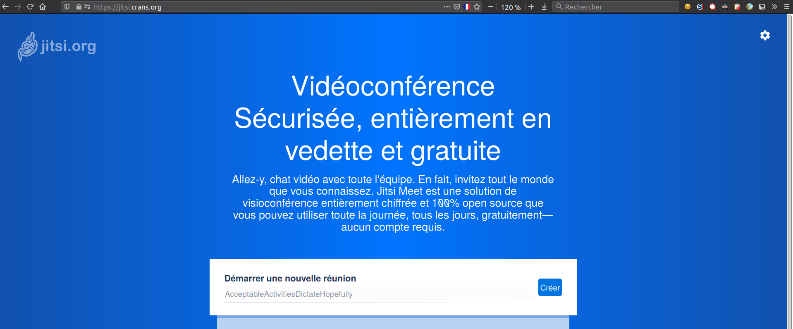

.. meta::
   :description lang=fr: A propos de Jitsi Meet
   :description lang=en: About Jitsi Meet

##################
 About Jitsi Meet
##################

.. note:: Small point of anger against the vocabulary: because I'm sick of everyone using the verb Skyper and the word Skype to say **video call**.

This little web page is written to advertise the `Jitsi Meet <https://jitsi.org>`_ tool.

What's wrong with Skype?
------------------------------------

Skype was bought out by Microsoft years ago.
Skype is a proprietary tool, not free, not peer-to-peer, not encrypted.
Basically, it's the worst possible solution for making video calls!

Skype requires an account, an email, it depends on Microsoft, audio and video traffic is spied on in real time (that's how they manage to offer translation and subtitles in real time), all the traffic goes through the USA, etc.

.. warning:: Basically, you make a call via Skype, well in three clicks and 24 seconds, Trump can see you, if he wants to...

And with Zoom / and with OTHER TOOL THAT SUCKS TOO ?
----------------------------------------------------

As long as the audio or video traffic goes through centralized servers, and is not encrypted end-to-end, other solutions have the same weaknesses.

This is the case for Zoom, Messenger/Facebook and Instagram.

WhatsApp, Telegram and Signal seem more secure since communications are encrypted from end to end, but each of these solutions require an account, identified either with an email address or a phone number.

------------------------------------------------------------------------------

And what solution do I propose?
-------------------------------

In the year 2020, using one of the above-mentioned solutions seems to me to be a serious mistake...
When there are so many secure, simple and installation-free tools with nothing to do: no account, just a link, you click and it works, in a fairly recent web browser (i.e., Firefox or Google Chrome or Chromium).

I recommend using **Jitsi Meet** !

- It's **free** : you have access to the source code, you can read it and modify it if necessary,
- It's free,
- It's **digitized**,
- It is (a priori) **not spied on** and **not easily spied on**,
- It **works without an account** and **without installation** (you can install the application on your phone but the web versions work without installation).

There is `meet.jit.si <https://meet.jit.si/>`_ which is the official server. The URL is simple to remember, and you have to agree with the other person in the call on a room name.

.. note:: Let's say Alice and Bob want to talk on Sunday, May 3rd...

    A good room name would be `meet.jit.si/Alice-and-Bob-03-May-2020 <https://meet.jit.si/Alice-et-Bob-03-mai-2020/>`_.

A Jitsi Meet server can't be overloaded since Jitsi Meet works in **peer-to-peer** : as soon as the call is launched, the network traffic (audio as well as video as text) goes through the central server but just between us !

Another Jitsi Meet instance?
~~~~~~~~~~~~~~~~~~~~~~~~~~~~

You can also use the instance on the server of the association CRANS of the ENS Cachan / Paris Saclay (of which I was an active member in 2012/13...): `Jitsi.crans.org <https://jitsi.crans.org/>`_ which is hosted in France, in Cachan, and managed by volunteers who don't spy on their users 😊!

The application on Android™
~~~~~~~~~~~~~~~~~~~~~~~~~~~

It works very well, and allows the use of meeting rooms, whether they are hosted on `meet.jit.si <https://meet.jit.si/>`_ or anywhere else on any server.

.. note:: See `this page about other applications for Android™.

Installing Jitsi Meet on your own computer
~~~~~~~~~~~~~~~~~~~~~~~~~~~~~~~~~~~~~~~~~~

It's very simple, just follow `this user guide <https://github.com/jitsi/jitsi-meet/blob/master/doc/quick-install.md>`_ on the jitsi-meet `GitHub <https://github.com/jitsi/jitsi-meet/>`_.

.. (c) Lilian Besson, 2011-2020, https://bitbucket.org/lbesson/web-sphinx/
