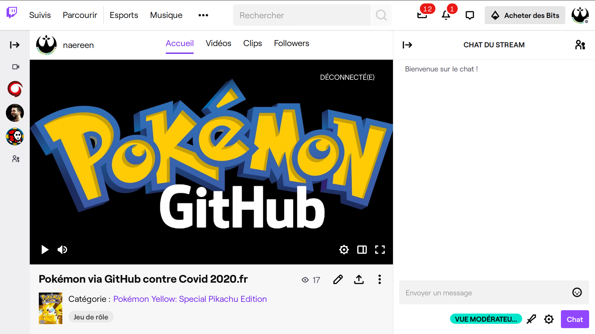
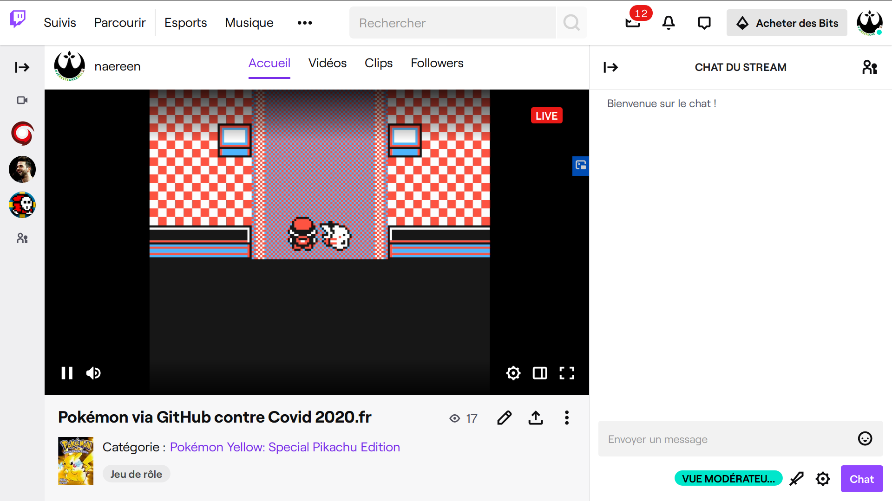

.. meta::
   :description lang=fr: A propos de Pokémon
   :description lang=en: About Pokémon

#####################
 A propos de Pokémon
#####################

Cette page parle de `Pokémon <https://fr.wikipedia.org/wiki/Pok%C3%A9mon>`_.

.. note:: Citons Wikipédia :

   Pokémon (prononcé [pɔ.ke.mɔn] ; en japonais ポケモン, Pokemon, prononcé [po̞kʲe̞mõ̞ɴ]) est une franchise créée par Satoshi Tajiri en 1996, présente en particulier en jeu vidéo, dans des séries éditées par Nintendo. Selon les statistiques de Nintendo en 2010, les jeux Pokémon se sont vendus à environ 250 millions d’unités. Le jeu vidéo Pokémon Rouge et Bleu s’est vendu à plus de 30 millions d’exemplaires, ce qui en fait un record des ventes dans l’histoire du jeu vidéo.

   La franchise est également exploitée sous forme d’anime, de mangas, et de jeux de cartes à collectionner. Dans la série animée homonyme, le personnage principal, Sacha, voyage à travers diverses régions fictives dans le but d’attraper de nouvelles sortes de monstres éponymes, un concept qu’on retrouve également dans les jeux vidéo de la franchise. Pokémon a eu un impact culturel très important dans les pays où il a été introduit, dont le Japon, les États-Unis, le Canada, la France et d'autres pays européens.

.. image:: https://upload.wikimedia.org/wikipedia/commons/thumb/9/98/International_Pok%C3%A9mon_logo.svg/1920px-International_Pok%C3%A9mon_logo.svg.png
   :scale: 50%
   :align: center
   :alt: Page Wikipédia sur Pokémon https://fr.wikipedia.org/wiki/Pok%C3%A9mon
   :target: https://fr.wikipedia.org/wiki/Pok%C3%A9mon

Projet Pokémon contre Covid-19
------------------------------

`Pokémon via GitHub contre Covid 2020 fr <https://pokemon-via-github-contre-covid-2020-fr.github.io/>`_ !

--------------------------------------------------------------------------------

Mes Pokémon préférés
--------------------

Mes Pokémon préférés de la génération 1 (liste sur `veekun.com <https://veekun.com/dex/pokemon/search?sort=evolution-chain&introduced_in=1>`_) :

1. Bulbizarre (liens : `veekun <https://veekun.com/dex/pokemon/bulbasaur>`_, `Poképédia <https://www.pokepedia.fr/Bulbizarre>`_, `PokéBip <https://www.pokebip.com/pokedex/pokemon/bulbizarre/bulbizarre>`_) ;
2. Ronflex (liens : `veekun <https://veekun.com/dex/pokemon/snorlax>`_, `Poképédia <https://www.pokepedia.fr/Ronflex>`_, `PokéBip <https://www.pokebip.com/pokedex/pokemon/ronflex/ronflex>`_) ;
3. Tortank (liens : `veekun <https://veekun.com/dex/pokemon/blastoise>`_, `Poképédia <https://www.pokepedia.fr/Tortank>`_, `PokéBip <https://www.pokebip.com/pokedex/pokemon/tortank/tortank>`_) ;
4. Pikachu (liens : `veekun <https://veekun.com/dex/pokemon/pikachu>`_, `Poképédia <https://www.pokepedia.fr/Pikachu>`_, `PokéBip <https://www.pokebip.com/pokedex/pokemon/pikachu/pikachu>`_) ;
5. Hypnomade (liens : `veekun <https://veekun.com/dex/pokemon/hypno>`_, `Poképédia <https://www.pokepedia.fr/Hypnomade>`_, `PokéBip <https://www.pokebip.com/pokedex/pokemon/hypnomade/hypnomade>`_) ;
6. Papillusion (liens : `veekun <https://veekun.com/dex/pokemon/butterfree>`_, `Poképédia <https://www.pokepedia.fr/Papillusion>`_, `PokéBip <https://www.pokebip.com/pokedex/pokemon/papillusion/papillusion>`_) ;
7. Gravalanch (liens : `veekun <https://veekun.com/dex/pokemon/graveler>`_, `Poképédia <https://www.pokepedia.fr/Gravalanch>`_, `PokéBip <https://www.pokebip.com/pokedex/pokemon/gravalanch/gravalanch>`_) ;
8. Akwakwak (liens : `veekun <https://veekun.com/dex/pokemon/golduck>`_, `Poképédia <https://www.pokepedia.fr/Akwakwak>`_, `PokéBip <https://www.pokebip.com/pokedex/pokemon/akwakwak/akwakwak>`_) ;
9. Dracolosse (liens : `veekun <https://veekun.com/dex/pokemon/dragonite>`_, `Poképédia <https://www.pokepedia.fr/Dracolosse>`_, `PokéBip <https://www.pokebip.com/pokedex/pokemon/dracolosse/dracolosse>`_) ;
10. Artikodin (liens : `veekun <https://veekun.com/dex/pokemon/articuno>`_, `Poképédia <https://www.pokepedia.fr/Artikodinu>`_, `PokéBip <https://www.pokebip.com/pokedex/pokemon/artikodin/artikodine>`_).

Mes Pokémon préférés de la génération 2 :

1. Pharamp (liens : `veekun <https://veekun.com/dex/pokemon/ampharos>`_, `Poképédia <https://www.pokepedia.fr/Pharamp>`_, `PokéBip <https://www.pokebip.com/pokedex/pokemon/pharamp/pharamp>`_) ;
2. Cotovol (liens : `veekun <https://veekun.com/dex/pokemon/jumpluff>`_, `Poképédia <https://www.pokepedia.fr/Cotovol>`_, `PokéBip <https://www.pokebip.com/pokedex/pokemon/cotovol/cotovol>`_) ;
3. Tyranocif (liens : `veekun <https://veekun.com/dex/pokemon/tyranitar>`_, `Poképédia <https://www.pokepedia.fr/Tyranocif>`_, `PokéBip <https://www.pokebip.com/pokedex/pokemon/tyranocif/tyranocif>`_).

Mes Pokémon préférés des autres générations :

1. Gardevoir de la génération 3 (liens : `veekun <https://veekun.com/dex/pokemon/Gardevoir>`_, `Poképédia <https://www.pokepedia.fr/Gardevoir>`_, `PokéBip <https://www.pokebip.com/pokedex/pokemon/gardevoir/gardevoir>`_) ;
2. Galeking de la génération 3 (liens : `veekun <https://veekun.com/dex/pokemon/aggron>`_, `Poképédia <https://www.pokepedia.fr/Galeking>`_, `PokéBip <https://www.pokebip.com/pokedex/pokemon/galeking/galeking>`_) ;
3. Drattak de la génération 3 (liens : `veekun <https://veekun.com/dex/pokemon/salamence>`_, `Poképédia <https://www.pokepedia.fr/Drattak>`_, `PokéBip <https://www.pokebip.com/pokedex/pokemon/drattak/drattak>`_).

Mes versions de Pokémon préférées
---------------------------------

1. Versions **Or et Argent**, jouées en 2001 sur Game Boy et plusieurs autres fois sur émulateur ;
2. Versions **Noir et Blanc**, jouée en 2012 sur Nintendo DS ;
3. Versions **Rouge Feu et Vert Feuille**, jouée en 2010 sur émulateur ;
4. Versions **X et Y**, jouée en 2014 sur Nintendo DS.

--------------------------------------------------------------------------------

Ma chaîne Twitch
----------------

J'ai désormais une chaîne sur `Twitch <https://Twitch.tv/>`_ : `Twitch.tv/Naereen <https://Twitch.tv/Naereen>`_.
Je vais essayer d'y "streamer" (= diffuser en temps réel) quand je jouerai à Pokémon (et d'autres jeux) pour les projets `Pokémon via GitHub contre Covid 2020 fr <https://pokemon-via-github-contre-covid-2020-fr.github.io/>`_, et d'autres projets similaires :

--------------------------------------------------------------------------------

Reprise de musiques de Pokémon
------------------------------

`Insane in the Rain <https://www.youtube.com/channel/UC_OtnV-9QZmBj6oWBelMoZw>`_ est une super chaîne YouTube qui fait des reprises de morceaux de musique de jeux vidéo en jazz.

.. youtube:: pb_V8CPGIPE

`Cette liste de lecture <https://www.youtube.com/watch?v=OEPfTXABIUw&list=PLG5z-46tZguJBt0wl6fvX4r_63w2BsQE6>`_ contient toutes les reprises de musiques de Pokémon, et j'aime beaucoup l'écouter !

.. youtube:: OEPfTXABIUw

.. seealso::

    `Cette page qui liste mes abonnements YouTube <ce-que-je-regarde-sur-youtube.fr.html>`_.

.. (c) Lilian Besson, 2011-2020, https://bitbucket.org/lbesson/web-sphinx/
