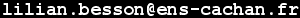

.. meta::
   :description lang=en: Lilian Besson's personal web page
   :description lang=fr: Page personnelle de Lilian Besson sur le web

############
 Pages (EN)
############

A few words about me
--------------------
Greetings!
I am **Lilian Besson**, a former `student <http://www.math.ens-cachan.fr/version-francaise/haut-de-page/annuaire/besson-lilian-128754.kjsp>`_
in Mathematics and Computer Science at `ENS de Cachan <http://www.ens-cachan.fr/version-anglaise/>`_
:gray:`(a French "Grande École" specialized in training researchers and professors for superior studies, located near Paris, in Cachan)`.

This year (*2016-17*), I will:

- Start my PhD `at Centrale-Supélec Rennes (SCEE, IETR) <http://www.rennes.supelec.fr/ren/rd/scee>`_, with `Christophe Moy <http://www.rennes.supelec.fr/ren/perso/cmoy/recherche.php>`_ and `Emilie Kaufmann <http://chercheurs.lille.inria.fr/ekaufman/research.html>`_. My PhD will be on multi-player multi-arms bandits problems applied to radio-telecommunication.
- And `teach <http://www.irisa.fr/fr/emplois/enseignants/missions-denseignement-au-departement-informatique-lens-rennes>`_ theoretical computer science at `ENS Rennes <http://www.dit.ens-rennes.fr/agregation-option-d/>`_ (for the agregation national exam) and `ENSAI <http://www.ensai.fr/formation/id-1re-annee.html>`_ (complexity and calculabilty).

`Contact information <callme.fr.html>`_
^^^^^^^^^^^^^^^^^^^^^^^^^^^^^^^^^^^^^^^
Feel free to *contact* me by, `the solution you prefer <callme.en.html>`_:

#. by *email* at this adress `Lilian.Besson＠ens-cachan.fr <mailto:Lilian.Besson＠ens-cachan.fr>`_, or `besson at crans.org <mailto:besson at crans.org>`_:

   .. image:: .telephone.png
      :scale: 130 %
      :align: right
      :target: callto:100101011101001100111101100001_2

#. you can call me or send me a SMS:

------------------------------------------------------------------------------

Last year (*2015-16*)
^^^^^^^^^^^^^^^^^^^^^
* I was a `research intern <https://people.epfl.ch/lilian.besson>`_ in the `BIG/LIB team <http://bigwww.epfl.ch/people.html>`_ at `EPFL (Lausanne, Switzerland) <http://www.epfl.ch/>`_, from April to August 2016, under the supervision of `Julien Fageot <http://bigwww.epfl.ch/fageot/index.html>`_ and `Michael Unser <http://bigwww.epfl.ch/unser/>`_. Check out the `git repository for my internship <https://bitbucket.org/lbesson/internship-mva-2016>`_ (`my Master thesis <https://goo.gl/xPzw4A>`_ is finished) !

* I am finishing the `MVA master program <http://www.cmla.ens-cachan.fr/version-anglaise/academics/mva-master-degree-227777.kjsp>`_ (at `ENS de Cachan`_), in applied Maths, mainly in `machine learning <https://en.wikipedia.org/wiki/Machine_learning>`_ and `numerical optimization <https://en.wikipedia.org/wiki/Mathematical_optimization>`_. Cf. `my documents written for the MVA <./publis/mva-2016/>`_, and `6 projects <https://bitbucket.org/lbesson/profile/repositories?search=MVA>`_: `PCS <http://lbesson.bitbucket.org/pcs2016>`_, `PGM <http://lbesson.bitbucket.org/pgm2016>`_, `RL / GML <http://lbesson.bitbucket.org/gml2016>`_, `Kernel <http://lbesson.bitbucket.org/kernel2016>`_, `Brain Imaging <http://lbesson.bitbucket.org/brain2016>`_, `Neuro-Sciences <http://lbesson.bitbucket.org/neuro2016>`_.

* I was also `teaching in Maths. <teaching.en.html>`_ and `in Computer Science <infoMP/>`_ in a prep' school for national competitive exams for French Engineering Schools (*"Grandes Écoles"*), at `"Lycée Lakanal" <http://www.lyc-lakanal-sceaux.ac-versailles.fr/>`_ in Sceaux (near Paris).

Studies and past jobs
^^^^^^^^^^^^^^^^^^^^^
.. include:: whatsnew.en.rst

* From mid-July 2014 to mid-May 2015, I **lived and worked in India**, `on the campus <https://goo.gl/maps/CcL2c>`_ of the new `Mahindra École Centrale <http://www.mahindraecolecentrale.edu.in/>`_ (a new *Engineering College* born from a partnership between the `(Indian) Mahindra group <http://www.mahindra.com/>`_ and `(French) École Centrale de Paris <http://www.ecp.fr/>`_).
  I was the first French faculty to work there full-time, and `I have been involved as a teaching assistant <http://web.archive.org/web/20150314101201/http://mahindraecolecentrale.edu.in/faculty.php?fid=26>`_, in charge of mathematics (`MA101 <./ma101/>`_ and `MA102 <./ma102/>`_) `tutorials <https://en.wikipedia.org/wiki/Tutorials#Tutorial_class>`_, and in charge of the `Computer Science CS101 course <./cs101/>`_ for the second semester!

* In 2013/2014, I `prepared <http://www.universite-paris-saclay.fr/en/node/6477>`_ the (French) `agregation of Mathematics <http://agreg.org/>`_ exam
  (national competitive exam for "*Prep Schools*" teacher recruitment, with a major in Maths and a minor in Computer Science). `I have been ranked 23rd  <http://web.archive.org/web/20140709144720/agreg.org/ResultatsMerite2014.html>`_, for 275 available positions, for 795 candidates allowed to pass the oral exam (second step) in June and July 2014, and almost 1200 persons registered in October 2013. I also did the second year of my **Master of Science** in Fondamental **Mathematics** (major) and **Computer Science** (minor), with a `speciality on teaching <http://www.universite-paris-saclay.fr/en/node/6477>`_. `A list of useful references (and other ressources) for this exam is here <agreg-2014/index>`_.

* In 2012/2013, I did the first year of the **MPRI** (`Master of Science <https://en.wikipedia.org/wiki/Master_of_science>`_ specialized in theoretical research in Computer Science, in Paris)
  and also the first year of the `Master of Science`_ in fondamental mathematics of ÉNS Cachan (again both `magna cum laude`_).

* From 2011/2012, I studied at `ÉNS Cachan <http://www.ens-cachan.fr/version-anglaise/>`_, and in July 2012, I completed two `Bachelors of Science <https://en.wikipedia.org/wiki/Bachelor_of_science>`_, one in **Mathematics** and one in **Computer Science**,
  both `magna cum laude <https://en.wiktionary.org/wiki/magna_cum_laude>`_.

* During two years, 2009/2010 and 2010/2011, I studied in Marseille, at `Lycée Thiers <https://simple.wikipedia.org/wiki/Lyc%C3%A9e_Thiers>`_, first in MPSI 2 and after in MP\*1.

* Before that, I lived in `Briançon <https://en.wikipedia.org/wiki/Briançon>`_ (Hautes-Alpes, *France*), and I got my `scientific baccalauréat <https://en.wikipedia.org/wiki/Baccalaur%C3%A9at#S.C3.A9rie_scientifique_.28S.29>`_, with a major in maths and a minor in theater, in 2009.

.. container:: smallpar

   **A few words about me**:

   I like to walk, travel, go camping around France and Europe, mainly by using `hitch-hiking <autostop.en.html>`_.
   I also like using new technologies, and enjoy design small games, or tiny pieces of software or web content
   (for instance `some nice javascript hacks <http://lbesson.bitbucket.org/README.html>`_), geeky tutorials (e.g. about `ga-beacon <beacon.en.html>`_, `GNU/Nano <NanoSyntax.html>`_, `Firefox <firefox-extensions.html>`_, `Sublime Text 3 <sublimetext.en.html>`_ or `git <tutogit.en.html>`_),
   or Linux command line tools (`see this page for example <https://bitbucket.org/lbesson/bin>`_).

   **A few words about this site**:

   I am working on this little website (currently, `<http://perso.crans.org/besson/>`_)
   when I have the time, hoping it can be useful to someone.
   :gray:`All the content of the website is (C) Lilian BESSON, and it is open source with the` `GPLv3 License <LICENSE.html>`_.
   `What means Open Source, explained with LEGO? <https://youtu.be/a8fHgx9mE5U>`_.
   This site's *Google Analytics* data suggest that some pages are indeed visited on a daily basis,
   so if you are here for something in particular, I hope you will not be disapointed
   (you can use `this bug tracker <https://bitbucket.org/lbesson/web-sphinx/issues/new>`_ to report any bug, or even to ask me anything).

------------------------------------------------------------------------------

.. note:: Contact me?

   Feel free to *contact* me by `the solution you prefer <callme.en.html>`_.

Some projects on-line
^^^^^^^^^^^^^^^^^^^^^
Some of my profile pages on some great websites:

  #. either with my *bitbucket* account `bitbucket.org/lbesson <https://bitbucket.org/lbesson>`_;
  #. or my *Github* account `GitHub.com/Naereen <https://github.com/Naereen>`_;
  #. or with my personal *Wikipedia* page `User:Naereen <http://en.wikipedia.org/wiki/User:Naereen>`_;
  #. or on *Transifex* `profile/Naereen <https://www.transifex.com/accounts/profile/Naereen/>`_ (almost not used anymore).

.. sidebar:: Other language: in French

   :red:`Cette page est en anglais. Peut-être voulez-vous la voir`
   `en français <index.fr.html>`_ :red:`?`
   Now, the page `<index.html>`_ should redirect to `<index.fr.html>`_
   or `<index.en.html>`_, according to the preference of your browser.

------------------------------------------------------------------------------

2nd year of MSc : Master MVA
^^^^^^^^^^^^^^^^^^^^^^^^^^^^
You can find `here all the documents written for the MVA <./publis/mva-2016/>`_ (2015-2016).
I also worked on 6 small research projects, all published on `my bitbucket <https://bitbucket.org/lbesson/>`_, open-source under the `MIT license <http://lbesson.mit-license.org/>`_.

For the 1st trimester (Fall 2015):

 - `Parcimonie and Compressed Sensing : « Random factorization for low-rank matrices » <http://lbesson.bitbucket.org/pcs2016>`_ ("finding structure with randomness"), graded :blue:`19/20`;
 - `Probabilistic Graphical Models : « Hidden semi-Markov Models » <http://lbesson.bitbucket.org/pgm2016>`_ (comparison to Hidden Markov Models and Gaussian Mixture Models), graded :blue:`16/20`;
 - `Reinforcement Learning / Graphs in Machine Learning : « Multi-Expert board-game Inference » <http://lbesson.bitbucket.org/gml2016>`_, graded :blue:`18/20`;

For the 2nd trimester (Spring 2016):

 - `Kernel Methods for Machine Learning : « Recognizing hand-written digits with a SVM classifier » <http://lbesson.bitbucket.org/kernel2016>`_ :orange:`new!`;
 - `Brain Imaging : « Decoding of fMRI images with the SpaceNet classifier » <http://lbesson.bitbucket.org/brain2016>`_ :orange:`new!`;
 - `Modelisation in Neuro-Sciences : « Self-Organizing Maps and Dynamical SOM » <http://lbesson.bitbucket.org/neuro2016>`_ :orange:`new!`.

MSc research internship in 2016
^^^^^^^^^^^^^^^^^^^^^^^^^^^^^^^
 "*A theoretical study of steerable convolution operators, and possible applications to stochastic processes for images*".

I will be a research intern in the `BIG/LIB team <http://bigwww.epfl.ch/people.html>`_ at `EPFL (Lausanne, Switzerland) <http://www.epfl.ch/>`_ (Swiss Federal Institute of Technology Lausanne), from April to August 2016, under the supervision of `Julien Fageot <http://bigwww.epfl.ch/fageot/index.html>`_ and `Michael Unser <http://bigwww.epfl.ch/unser/>`_. Check out the `git repository for my internship <https://bitbucket.org/lbesson/internship-mva-2016>`_ (`my Master thesis <https://goo.gl/xPzw4A>`_ is almost done) !

MSc research internship in 2013
^^^^^^^^^^^^^^^^^^^^^^^^^^^^^^^
 "*Towards modularity for planning and robot programs verification*".

I did a research internship for the third semester of my Maths MSc and CS MSc from 03 June to 09 August 2013.

.. sidebar:: Résumé

   My *résumé* is available here `<cv.pdf>`_.
   It is realized with ``LaTeX``, and the package *moderncv*.

I worked at `UCL <http://ucl.ac.uk/>`_ (University College of London),
under the direction of `Jules Villard <http://www0.cs.ucl.ac.uk/staff/J.Villard/>`_ (who quotes me `on his new page <http://www.doc.ic.ac.uk/~jvillar1/>`_, and `Peter O'Hearn <http://www0.cs.ucl.ac.uk/staff/p.ohearn/>`_,
about separation logic, planning in `AI`, and the study of *modularity* in those two domains.

My report (in English): `<rapportM1Info13.pdf>`_, and my slides (in French): `<slidesM1Info13.pdf>`_.

:Mark: Jules gave me **19/20**. I got the mark **17.7/20** from the Computer Science jury at ENS Cachan, and **18.50/20** from the Maths jury at ENS Cachan (september 2013).

------------------------------------------------------------------------------

All pages in English
--------------------
For more details, see `<sitemap.en.html>`_.

.. toctree::
   :maxdepth: 2
   :titlesonly:

   callme.en
   cv.en
   teaching.en
   cookies.en
   sublimetext.en
   ga.en
   stats-google-analytics.en
   beacon.en
   apk.en
   firefox-extensions.en
   tutogit.en
   wakatime.en
   zotero.en
   runblock.en
   transifex.en
   iteri.en
   opendns.en
   latexonwindows.en
   learn-python.en
   online-gnu-octave.en
   matlab-clones.en
   wolfram.en
   graph.en
   top10.en
   hitch-hiking.en
   packing.en
   plume-air-paris.en
   self-quantified.en
   README
   mount.en
   demo
   alaskabombeh.en

.. (c) Lilian Besson, 2011-2016, https://bitbucket.org/lbesson/web-sphinx/
