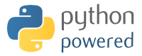

.. meta::
   :description lang=en: (old page) Precisions on quoted trademarks on this web site
   :description lang=fr: (vieille page) Quelques précisions sur les marques commerciales citées sur ce cite

###########################################
 Precision about the quoted **trademarks**
###########################################

This page is written to clarify some *« legal »* points regarding my webpages.

.. warning:: This page is old and :red:`NOT UP-TO-DATE` at all!

.. todo:: Keep it up-to-date!

About
-----
 This little page is intented to quote the trademarks I quote
 in the other pages. And also to give an almost exhaustive
 list of the software and usefull website I'm using for my projects.

------------------------------------------------------------------------------

Institutions
------------
 I'm trying to keep a list of all quoted institution,
 and to clarify here the one which I am connected to
 and the others.

ENS de Cachan
~~~~~~~~~~~~~
 Just to precise : I am a **student** at ENS de Cachan.
 Not a teacher, not anything else than a student.

 But it could be a source of misunderstanding : I am a student, ok,
 but with the *special* French status ``normalien``.

 That means that I'm affiliated with the French *'Enseignement Supérieur'*
 minister, and I receives a salary for this.

 I entered to this school by passing a national exam, in 2011.

 .. note::

    So, when I quote 'ENS de Cachan', in my pages or in my source codes,
    that **always** means that I'm a student,
    and also that a significant part of my work is **related** to the work
    “I have to do *at school*”.

CMLA (Maths research institute)
~~~~~~~~~~~~~~~~~~~~~~~~~~~~~~~
 The CMLA is the Mathematics research institute of ENS de Cachan.

 Again, I am **not** a member of the CMLA. At least, a lot of
 the maths teachers I heard during the past two years are related to the CMLA,
 but nothing else.

 .. note::

    So, when I quote 'CMLA', in my pages or in my source codes,
    that **never** means that I'm a member of CMLA,
    but that means a part of this content is related to the work
    “I have to do *at school*”.

LSV (*CS* research institute)
~~~~~~~~~~~~~~~~~~~~~~~~~~~~~
 The LSV is the Computer Science lab research of ENS de Cachan.

 Again, I am **not** a member of the LSV. At least, a lot of
 the CS teachers I heard in the last two years are related to the LSV,
 but nothing else.

 .. note::

    So, when I quote 'LSV', in my pages or in my source codes,
    that **never** means that I'm a member of LSV,
    but that a part of the content is related to the work
    “I have to do *at school*”.

CNRS (French scientific research institute)
~~~~~~~~~~~~~~~~~~~~~~~~~~~~~~~~~~~~~~~~~~~
 The CNRS is the French Institude for Scientific Research
 ("Centre National de la Recherche Scientifique").

 I have no connection to the CNRS. Not at all.

 Anyway, I used their name and their logo for a few months,
 on a few pages.
 **For this, I sincerely appologize** : I will no longer do such a thing.

 .. note::

    I'm trying to clean up some of my old codes,
    and my old web pages, to erase all occurrences
    of the CNRS name or logo.
    If you find of I forgot to erase, please inform me.

------------------------------------------------------------------------------

Trademarks
----------
 All the quoted trademarks on this page and on all the page on this domain
 are the respective properties of their owners.

A non exhaustive list
~~~~~~~~~~~~~~~~~~~~~
 I'm trying here to keep a list of all the trademarks I quote in my pages.
 If I forgot one, and if that bother you, please
 `contact me <mailto:lilian DOT besson AT normale DOT fr>`_.

In particular,
 * Matlab is © and ® of MathWorks,
 * Windows is © and ® of Microsoft,
 * TI, TI-Basic and TI-82 is © of Texas Instrument,
 * Jota Text Editor is © and ® of Aquamarine Networks,
 * GnuPG, Octave, Nano, Gnu Make, Gedit are © and ® of The Gnu Software Foundation,
 * TOEIC is © of ETS,
 * CUDA and nVidia CUDA are © and ® of nVidia,
 * Python, PyDOC, Pypi and Sphinx are © and ® of The Python Foundation,
 * OCaml, and OCamlDoc are © and ® of INRIA,
 * XML, HTML, Javascript are name of technologies developped by the WWW consortium, and the Mozilla Foundation,
 * Firefox is © and ® of the Mozilla Foundation,
 * Google Analytics, Google, Google Code, Google Site and Youtube are © and ® of Google Inc.,
 * reStructuredText and docutils are © and ® of David Goodger et al.,
 * Wikipedia, Wikibook are © and ® of The Wikimedia Foundation,
 * Ubuntu and all related trademarks are © and ® of Canonical,
 * Bitbucket is © of Atlassian Inc.,
 * Django and the term *'Django templating'* are © and ® of the Django Software Foundation,
 * Nautilus, Gnome Terminal and many others related to the GNOME project are © of The Gnu Software Foundation,
 * VLC is ® and © of the Videolan Foundation,
 * Facebook is © and ® of Facebook Inc.,
 * Android, Google Play and Android Market are © and ® of Google Inc.,
 * MIT, mit.edu refer both to the Massachusetts Institute of Technology,
 * Ångström is a © and ® of The Ångström Distribution foundation,
 * Debian is © and ® of The Debian Project,
 * Doxygen is © of Dimitri van Heesch,
 * Java and JavaDoc, and Eclipse are © of Oracle,
 * Skype, MSN and Outlook are © of Microsoft Corporation,
 * Naereen Corp. is © of Lilian Besson (yes, it's me !),
 * Graphviz, the DOT command line tool and the DOT graph language, are © of AT&T research labs on graphs,
 * Ghostery is © and ® of Ghostery™,
 * HeVeA is © of Luc Marranget,
 * Nintendo, for some pictures of Link and Zelda (© & ®),
 * ACE (and ace.js) is © & ® of AjaxOrg,
 * and many others…

------------------------------------------------------------------------------

Used softwares
--------------
I usually try to quote and to say what software I used to produce the different available files
on each of my web pages and projects descriptions,
but to be more precise, I'm also trying to quote them all here.

So, I used the following software :
 * Gedit, for text editing,
 * GNU Nano, for text editing,
 * GNU Make, for automatize generation and synchronization,
 * git, for version control and online storage,
 * GNU sh, and GNU Bash for command line operation automatization (scripting),
 * Python, for a lot a things,
 * Sphinx, for web pages generation from rST files,
 * rst2pdf (from docutils) for PDF generation from rST files,
 * pdflatex, for PDF generation from LaTeX files,
 * OCaml and OCamlDoc, for a lot of projects,
 * GNU Octave, for a lot of math simulation,
 * pyflakes, pylint, pychecker, flakes8, for automatize Python source code verification,
 * pyreverse, for dependancies graph generation for Python projetcs,
 * Gnome Terminal and Terminator, for command line use (in particular, many screenshots use the embedded screen shot facility of Terminator),
 * byobu, screen and tmux, for terminal multi-plexing,
 * scp and rsync, to send files throw ssh,
 * ssh, to remotely control the two web server I'm using,
 * GNU PG, to sign and cipher some files,
 * Zenity, for some command line graphical interactivity,
 * notify-send, for some graphical informative messages in some scripts,
 * GNU grep and ack-grep, GNU sed for text search and manipulations in command line mode,
 * zip, 7z, tar, gzip, bzip, xzip, and others compression and archive tools,
 * Nautilus, the GNOME file manager,
 * Firefox (or Iceweasel) and elinks for web browsing (in graphical or text mode),
 * Hotmail, from Microsoft, and GNU mutt, for email management,
 * bpython, as an enhanced Python toplevel system,
 * utop, as an enhanced OCaml toplevel system,
 * many Python module : scanf, PyZenity, pynotify, pygame, and many others,
 * irsii, as a IRC client,
 * Jota Text Editor, as a quick and powerful text editor on Android,
 * Android (1.6, 2.2.2), as the best OS for smartphones !
 * Ångström, for my mini ARM pc,
 * unblockyoutube.co, to test my web pages from an outsider point of view (*i.e.* without cookies),
 * Icon Converter, from `softicons.com <http://www.softicons.com/icon-tools/icon-converter>`_,
 * Ubuntu 11.10 to Ubuntu 15.10 as the best OS,
 * htop, as a text mod for managing processes on my PCs,
 * vrun, a telnet command line client for VLC (thanks to Nit from the Crans association for this one),
 * `doc.ubuntu-fr.org <http://doc.ubuntu-fr.org>`_ as a constant and almost perfect source of inspirations,
 * Wikipedia and all related Wikimedia project,
 * Google Calendar, ang Google Analytics, respectivly to store calendars online, and to monitor my web pages,
 * Javascript and Django templating (for Sphinx) to automatically embbed the Google Analytics script,
 * caml2html, pyhtmlizer and pygmentize to generate HTML pages from source code,
 * JDownloader, as the best Youtube downloader, even if it is written in Java…
 * Cover Thumbnailer and Nautilus Terminal plug-ins for Nautilus,
 * Arandr and ArandrAuto (my script) to handle multi screens on Ubuntu,
 * HeVeA, as a powerfull LaTeX to HTML conversion tool,
 * js_of_ocaml, and toplevel.js, as a OCaml toplevel written in Javascript,
 * emscripten, to embed GNU Plot and Python,
 * Skulpt, as an other Python toplevel written in JavaScript,
 * html2rest, a Python script to convert HTML to rST,
 * `Generate It <http://www.generateit.net>`_, for some services,
 * Gravatar and Worldpress,
 * FreeDNS for shortlink (http://perso.crans.org/besson and others),
 * Pixlr online picture editor (`<http://pixlr.com/editor/>`_),
 * and many others…

------------------------------------------------------------------------------

.. (c) Lilian Besson, 2011-2021, https://bitbucket.org/lbesson/web-sphinx/
