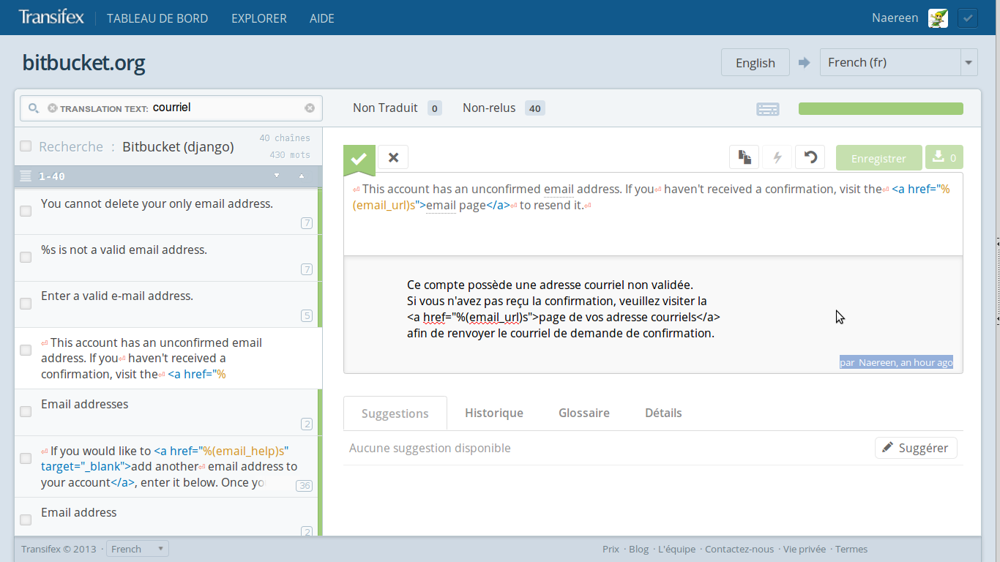
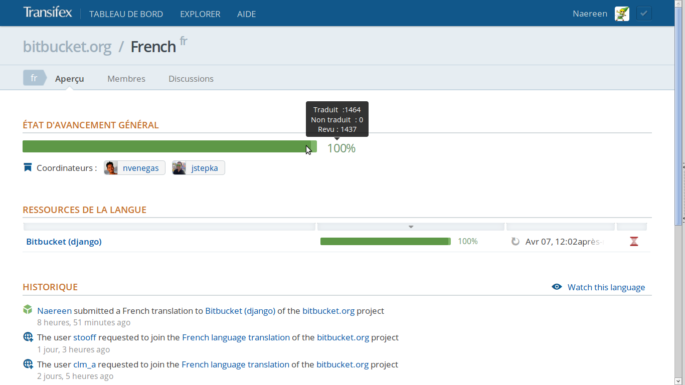
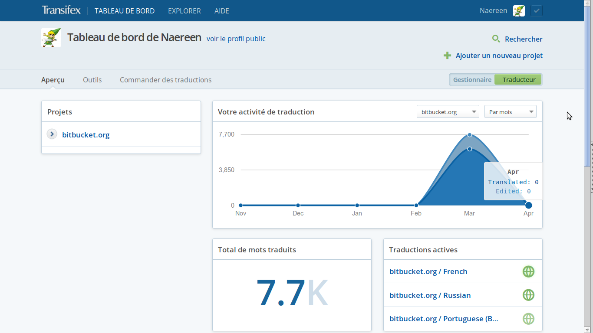

.. meta::
   :description lang=fr: À propos de la traduction de bitbucket.org
   :description lang=en: About the French translation of the web site bitbucket.org

##############################
 Translation of BitBucket.org
##############################
.. include:: .special.rst

.. sidebar:: Other language : in French

   This page is in *English*.
   Maybe you would like to see it in `French <transifex.fr.html>`_.

On Tuesday, March 26, `bitbucket <https://bitbucket.org/>`_ announced
a discreet message advising of the proposed translations of the site.

Curious, I went take a look at the software.

Translation **EN** *→* **FR**
-----------------------------
Transifex
^^^^^^^^^
 That's how the translation platform they used is called.

 A few moments later, I had created an account,
 and I therefore chair me for this translation project (see 
 `profile/Naereen  <https://www.transifex.com/accounts/profile/Naereen/>`_).

 Barely time to get a coffee (it was 5:06 in the morning ^^),
 that my application had been validated by the administrator
 `Justen Stepka <https://www.transifex.com/accounts/profile/jstepka/>`_.

Progress
^^^^^^^^

 The translation was advanced at **11%** when I logged in,
 with the sober figure of 1389 phrases or words to translate.

Translation interface
^^^^^^^^^^^^^^^^^^^^^
  Here is a preview of the interface:

Encountered difficulties
^^^^^^^^^^^^^^^^^^^^^^^^
 The main difficulie is the fact of not being alone to translate.

 `Transifex <https://www.transifex.com>`_ platform offers a multi-user edition.

 And fortunately!

 It significantly accelerates the work.

 Except when the other translator is using terms different than mine,
 as *ticket* for issues, and I wanted to use *bug* or 
 *signalement de bug*.

 But the collaboration went well, and I think this highly increase
 the translation's quality.

 Otherwise, to translate the terms technical *push*, *pull*, *commit*, *tag*,
 *head*, *master*, *merge*, *fork*
 and others prove to be relativly hard to translate.

 Suddenly, fork was kept as *fork* in French because neither he (**oliv.rm**)
 or me have found a correct term instantly.

 .. note:: Update

    Someone decided to use "*bifurcation*" to design a "fork",
    and "*bifurquer*" to design the verb "to fork".

Result
------
 The following embedded diagram should show the result (in real time)
 of the evolution of translations for bitbucket.org website :

.. raw:: html

   
   
   
Loading chart...

   <h4>Embedded chart thanks to Transifex's API, © of Transifex</h4>

------------------------------------------------------------------------------

  **Nice graphic right ?**
  The French translation has reached 100%, within 12 h 30, 
  and is therefore the first completed.

  **Congrats to us !**
  A few revisions later, and to 1 pm it was really finished.

------------------------------------------------------------------------------

And after?
----------
  This little adventure got me interested in translation projects,
  and I think I'll look at make it **more regularly** !

Offer me to do a translation
^^^^^^^^^^^^^^^^^^^^^^^^^^^^
  So, if you are interested in a translation
  (FR → EN or EN → FR)
  of your website, software or otherwise
  do not hesitate to contact me (`you will find out how here <index.html>`_).

Update their web-service
^^^^^^^^^^^^^^^^^^^^^^^^
  I think the web site *transifex* is awesome !

  But, the lack of statistics overview for a translation project appears to
  be annoying, so I asked them `here on support.transifex.com 
  <http://support.transifex.com/customer/en/portal/questions/908374-see-some-statistics-for-a-translation-project-?new=908374>`_
  if there is a way to add this kind of functionnality.

More screenshots
^^^^^^^^^^^^^^^^
  More screenshots about this can be found on my Facebook page
  `there <http://www.facebook.com/media/set/?set=a.10200855332964454.1073741826.1198154202&type=1&l=624387ae61>`_.

------------------------------------------------------------------------------

What's next ?
-------------
 Since the first day of translation, some piece of sentences and some words
 are still frequently added to the project, mainly by the two administrators
 `jstepka <https://www.transifex.com/accounts/profile/jstepka/>`_ and
 `nvenegas <https://www.transifex.com/accounts/profile/nvenegas/>`_.
 
 That's why, each 2 or 3 days, the completion rate of the project
 for the French language go down to 98% or 99% again.

 So, as soon as I see this, I try to complete again the translation process,
 by translating about 20 or 30 sentences.

About the French translation : 13000~ words !
^^^^^^^^^^^^^^^^^^^^^^^^^^^^^^^^^^^^^^^^^^^^^
 The following screenshot shows the progression of the French translation :

My profile
^^^^^^^^^^
 And this last screenshot shows my (private) profile,
 which shows that I translated about 12500 words on the French
 part of the translation project of *bitbucket.org* !
 (this figure is probably out-dated, I wrote this paragraph the 25th January 2014)

 So, this allows to compute that I translated about **97%** of the **13000~**
 words of the project. (again, this figure might be out-dated)

------------------------------------------------------------------------------

Next chapter
------------
I'm still interested in any softwares or websites translation. I just have to like
and frequently use the program or the website.

Also in Transifex
^^^^^^^^^^^^^^^^^
In Transifex, again, I'm participating in some translations :

 * `Sphinx <http://sphinx-doc.org/>`_
 * `XFCE <http://xfce.org>`_
 * Gibberbot,
 * and the Transifex website itself!

And I have also been accepted in others teams, but I haven't participate yet :

 * Webmin,
 * Roundcube,
 * txt2tags,
 * VLC,
 * The Tor Project,
 * GPG for Android,
 * Mozilla Webmaker.

.. seealso:: More details on my `public Transifex profile <https://www.transifex.com/accounts/profile/Naereen/>`_

Other translations
^^^^^^^^^^^^^^^^^^
.. seealso:: `linux-dash <https://bitbucket.org/lbesson/linux-dash>`_

   In February 2014, I forked and translated the `github.com/afaqurk/linux-dash <https://github.com/afaqurk/linux-dash/>`_ project.

.. (c) Lilian Besson, 2011-2014, https://bitbucket.org/lbesson/web-sphinx/