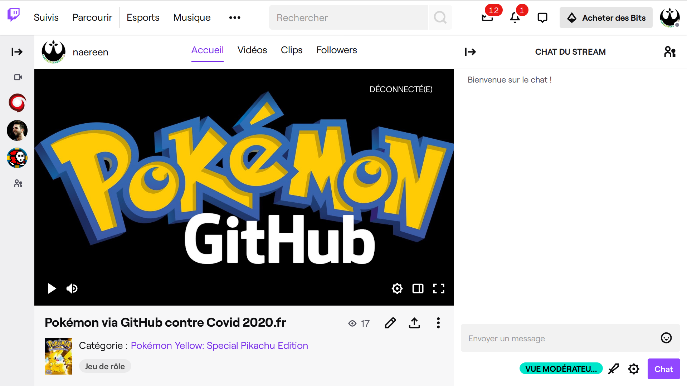
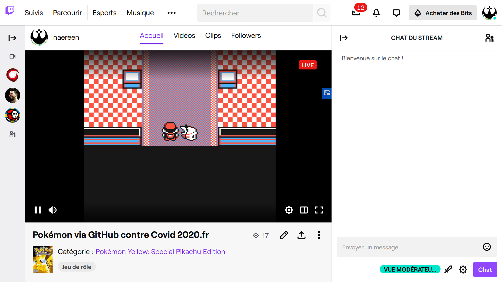
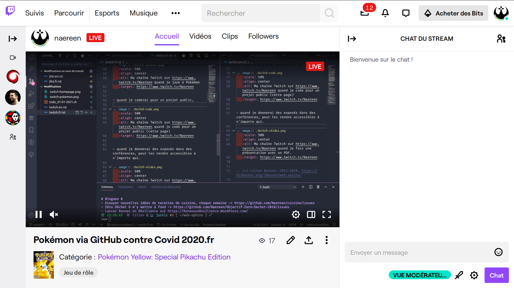
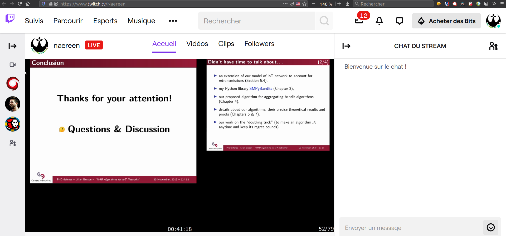

.. meta::
   :description lang=fr: A propos de Twitch
   :description lang=en: About Twitch

####################
 A propos de Twitch
####################

Qu'est-ce que Twitch ?
----------------------

Pour citer `la page Wikipédia <https://fr.wikipedia.org/wiki/Twitch>`_ :

    Twitch est un service de streaming et de VOD de jeu vidéo, de sport électronique et d'émissions apparentées lancé en juin 2011.

    Le site a été créé afin d'avoir un site consacré à la branche jeux vidéo de Justin.tv, qui était la partie la plus populaire du service. Le nouveau site va alors surpasser son parent, qui ferme en août 2014, pour que l'entreprise se concentre essentiellement sur Twitch.

    D'après Emmett Shear, le cofondateur et dirigeant du site, celui-ci avait au début de 2012 près de 15 millions de visiteurs mensuels. Twitch compte aujourd'hui un peu plus de 1000 employés, avec des bureaux basés à San Francisco.

    Twitch permet aux spectateurs (couramment appelés viewers) de disposer d'un large éventail de diffusions de jeux vidéo, proposés par des personnes souhaitant diffuser ces contenus en direct (appelés également streameurs), et couvrent ainsi la plupart des genres. Les genres les plus populaires sont les jeux de stratégie en temps réel (RTS, MOBA), les jeux de combat, les jeux de courses et les jeux de tir à la première personne (FPS), entre autres. Les jeux type bac à sable (sandbox) attirent également beaucoup de spectateurs, le plus connu étant Minecraft. La page d'accueil affiche les jeux les plus diffusés sur le site.

Ma chaîne Twitch
----------------

J'ai désormais une chaîne sur `Twitch <https://Twitch.tv/>`_ : `twitch.tv/LilianBessonENS <https://twitch.tv/LilianBessonENS>`_.

Je vais essayer d'y "streamer" (= diffuser en temps réel) pour les occasions suivantes :

- quand je jouerai à Pokémon (et d'autres jeux) pour les projets `Pokémon via GitHub contre Covid 2020 fr <https://pokemon-via-github-contre-covid-2020-fr.github.io/>`_, et d'autres projets similaires :

- quand je coderai pour un projet public :

- quand je donnerai des exposés dans des conférences, pour les rendre accessibles à n'importe qui :

.. (c) Lilian Besson, 2011-2021, https://bitbucket.org/lbesson/web-sphinx/
