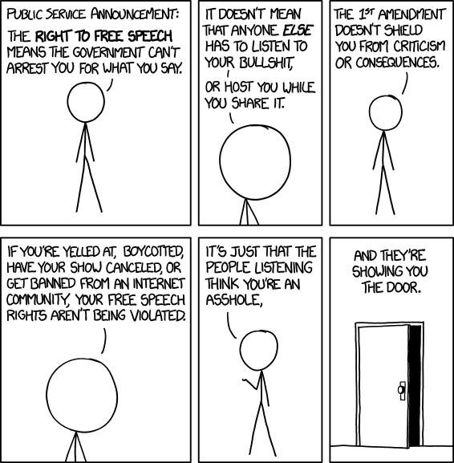
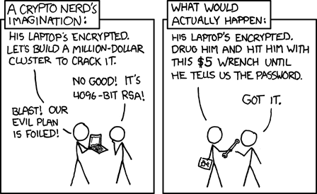

.. meta::
    :description lang=fr: Page donnant des liens vers des outils permettant le respect de sa vie privée.
    :description lang=en: A list of links for tools designed to improve your privacy. In french :(

#########################################
 Liste d'outils de sécurité informatique
#########################################

.. todo:: Après des années sans trop m'inquiéter, mon « mode aléatoire » (générateur avec des dés et des pièces) m'a demandé de changer drastiquement, le vendredi 16 avril 2021. Donc je change. Je ne vais plus accepter de montrer ma caméra, et je vais être très prudent dès maintenant. Merci d'avance d'accepter cela dans nos interactions professionnelles ou personnelles !

.. seealso:: Guide par John Mason

    `Ce guide <https://thebestvpn.com/online-privacy-guide/>`_ est très bien conçu (en anglais).

.. seealso:: Guide par Maria Flagg

    `Ce guide <https://techiepassion.com/online-privacy-guide-2019/>`_ est intéressant (en anglais).

.. seealso:: Guide par Stacy Johnna

    `Ce guide <https://www.bestreviewslist.com/online-safety-guide/>`_ est intéressant (en anglais).

.. seealso:: Slides par Micah Flee

    `Ces slides <https://raw.githubusercontent.com/micahflee/slides/master/2013/10/sfpl_crypto.pdf>`_
    sont très bien faits, et présentent rapidement l'importance des outils de crypto-sécurité (en anglais).

---------------------------------------------------------------------

À-propos
--------
Cette page est pas vraiment utile.

Si ce n'est pour avoir une seule page présentant plein de liens vers des services utiles (et variés).

.. sidebar:: Retourner à l'accueil

    Si cette page ne vous intéresse pas, allez plutôt consulter `celle là <index.html>`_.

---------------------------------------------------------------------

Liste des outils
----------------
.. note:: Contribuer ?

    N'hésitez pas à m'envoyer des liens supplémentaires !

.. note:: Liste des références

   * `article du monde "Comment protéger ses sources" <http://bugbrother.blog.lemonde.fr/comment-proteger-ses-sources/>`_,
   * `securityinabox.org/fr <https://securityinabox.org/fr>`_ le guide de **référence ultime en sécurité informatique**.

---------------------------------------------------------------------

Distribution Linux "la plus sécurisée"
^^^^^^^^^^^^^^^^^^^^^^^^^^^^^^^^^^^^^^
* `<https://tails.boum.org/index.fr.html>`_ Tails : The Amnesic Incognite Live System (enfin en version stable ``1.0``).

Crypter ses communications
^^^^^^^^^^^^^^^^^^^^^^^^^^
* `Voir cette liste complète qui compare différents outils <https://www.eff.org/secure-messaging-scorecard>`_, par l'équipe de `l'EFF (Electronic Frontier Foundation) <https://www.eff.org/about>`_. Cette liste a été mise à jour et se trouve désormais sur `ce site (Comparitech) <https://comparite.ch/encrypted-messaging>`_.

* `GnuPG <http://www.gnupg.org/download/>`_ pour chiffrer ses courriels. Voir aussi `<pgp.html>`_ pour plus d'infos, ou `<Lilian_Besson.asc>`_ pour récupérer ma clé publique

* `Of-The-Record Messaging (for Pidgin) <http://www.cypherpunks.ca/otr/index.php>`_,

* `SNOW <http://www.darkside.com.au/snow/>`_, pour intégrer un message dans un fichier texte sous la forme d'espaces en fin de lignes. Faut quand même être sacrément velu pour envisager ça !

* `TextSecure : Privacte Messages <http://apk-dl.com/store/apps/details?id=org.thoughtcrime.securesms>`_ pour crypter ses SMS (avec d'autres utilisateurs de TextSecure). À noter que `WhatsApp <http://www.whatsapp.com/>`_ propose `désormais la même chose ! <https://korben.info/whatsapp-integre-maintenant-chiffrement-bout-en-bout-grace-au-protocole-textsecure.html>`_.

* Mise à jour en février 2019 : une bonne alternative à ces solutions est le fameux `Telegram <https://telegram.org/>`_ ! `Ce petit article <https://www.vpnmentor.com/blog/best-secure-alternatives-whatsapp/>`_ donne une liste d'alternatives sécurisées à WhatsApp, et Telegram est en tête !

---------------------------------------------------------------------

Garantir son idendité
^^^^^^^^^^^^^^^^^^^^^
* `GnuPG <http://www.gnupg.org/download/>`_ pour signer des fichiers ou des courriels. Voir aussi `<pgp.html>`_ pour plus d'infos, ou `<Lilian_Besson.asc>`_ pour récupérer ma clé publique

---------------------------------------------------------------------

Crypter ses fichiers
^^^^^^^^^^^^^^^^^^^^
* `GnuPG <http://www.gnupg.org/download/>`_ pour crypter avec la clé publique d'un destinataire ou la sienne (voir `<Lilian_Besson.asc>`_ pour récupérer ma clé publique)

* `wuala <https://www.wuala.com/fr/download/linux>`_ est un service gratuit de stockage de fichiers dans les nuages. Il se clame sécurisé (et en a tout l'air). Propose 5 Go. Apparamment, une application pour Ubuntu (à-la Dropbox), mais malheureusement basée sur Java.

* `SpiderOak <https://spideroak.com/opendownload/>`_ fait pareil. Propose 2 Go.

* `Dupticati <http://www.duplicati.com/>`_ (cf. `ce post sur korben.info <https://korben.info/chiffrez-vos-sauvegardes-avant-de-les-envoyer-dans-le-cloud.html>`_) est à utiliser avec l'un de ces hébergeurs.

---------------------------------------------------------------------

Outils de "communication" à usage unique
^^^^^^^^^^^^^^^^^^^^^^^^^^^^^^^^^^^^^^^^
* Ce guide est très bien fait, `<https://thebestvpn.com/anonymous-email/>`_.

* `anonbox.net <https://anonbox.net/fr/>`_ propose une adresse courriel à usage unique (un seul message reçu, en texte brute ASCII, avec les pièces jointes encodées en base64 : un courriel "dans sa forme brute" quoi).

* `10minutemail.com <http://10minutemail.com/10MinuteMail/index.html>`_ propose aussi une adresse email qui s'auto-détruit 10 minutes plus tard, mais sans possibilité de lecture.

* `send-email.org <http://send-email.org/>`_ permet d'envoyer de petits courriels (moins de 2000 caractères) sans pièce jointe à n'importe qui, très facilement. Super pratique !

* Et `anonymousemail.me <https://anonymousemail.me/>`_ fait pareil, en plus joli !

* `cURL.io <http://curl.io/>`_ permet d'envoyer des fichiers, en clair ou chiffré, via le terminal. Et en plus, leur site web est très bien réalisé (minimaliste, mais superbe).

* `CryptoCat <https://crypto.cat/>`_ propose un système de *chat* sécurisé.

* `PrivNote <https://privnote.com/>`_ permet de créer des notes à usage unique, il suffit de transmettre une URL pour transmettre le message.

* `NoPlaintext <https://noplaintext.com/>`_ fait la même chose. Une bonne idée est de chaîner les différents services.

* `ZeroBin <http://sebsauvage.net/paste/>`_ est un pastebin (un presse-papier électronique, pour faire des copier-coller) à usage unique, sécurisé par ``AES 256``. Mention spéciale pour le *« Kittens will die if you abuse this service »* dans la note en haut de page :) ! :red:`New!` Le `Crans <https://www.crans.org/>`_ héberge désormais sa propre copie de `ZeroBin`_, ici sur `zero.crans.org/ <https://zero.crans.org/>`_.

* `CryptoBin <https://cryptobin.org/>`_ est très similaire.

* `WebRTC Copy <https://rtccopy.com/>`_ est un service web d'échange de fichier en ``P2P`` (pair à pair, donc le fichier est sensé ne pas passer par un serveur annexe). Marche super bien !

* :red:`N'existe plus !` `IMG.bi <https://img.bi/>`_ est un service web d'échange de photo, sécurisé par ``AES 256``. Fonctionne vraiment bien, et propose même la possibilité d'effacer l'image après la première visualisation ! `ZimageZ <http://www.zimagez.com/>`_ propose des fonctionnalités similaires… mais il semble moins sécurisé et moins garant de votre vie privée.

* `Digify <http://www.digify.com/about/>`_ permet d'envoyer des fichiers qui s'auto-détruiront (comme présenté `ici par Korben.info <https://korben.info/digify.html>`_).

* `Snap Me Now <http://www.snapmenow.com/>`_ permet d'envoyer des photos prises par sa webcam, à un nombre limité de personnes (max. 100) pendant une période limitée (max. 10 minutes) (c'était présenté `ici aussi par Korben.info <https://korben.info/clone-snapchat-navigateur.html>`_). C'est un genre de clone minimaliste de *Snapchat*.

* `PeerIO <https://www.peerio.com/>`_ propose aussi des fonctionnalités intéressantes.

* Ces listes peuvent donner des astuces supplémentaires : `envoyer un texto anonymement <https://www.wikihow.com/Send-an-Anonymous-Text>`_, `envoyer un courriel anonymement <https://www.wikihow.com/Send-An-Anonymous-Email>`_.

---------------------------------------------------------------------

Protéger sa vie privée
^^^^^^^^^^^^^^^^^^^^^^
* `Cet article du Monde peut donner des idées, sur l'obfuscation <http://internetactu.blog.lemonde.fr/2014/11/10/lobfuscation-strategie-de-resistance-a-la-surveillance/>`_.

* `MAT (Metadata Anonymisation Toolkit) <https://mat.boum.org/>`_, pour effacer les méta-données de différents types de fichiers.

* `Exiv 2 <http://www.exiv2.org/>`_, un outil pour effacer les données EXIF des images.

* `jHead <http://www.sentex.net/~mwandel/jhead/>`_, est du même genre. Consultez `<http://www.sentex.net/~mwandel/jhead/usage.html>`_ pour une documentation.

* `Privly <https://priv.ly/>`_ est un concept bizarre, pour échanger des liens à d'autres utilisateurs qui ont aussi installé l'extension Privly dans leur navigateur.

* `Tor <https://torproject.org/>`_ pour communiquer de façon sécurisée. Voir par exemple `ce schéma interactif <https://people.torproject.org/~lunar/tor-and-https/fr/tor-and-https.svg>`_ pour mieux comprendre l'intérêt de ``HTTPS`` et ou de `Tor`_.

* `DuckDuckGo <https://www.duckduckgo.com/>`_ est un moteur de recherche indépendant, concurrent à Google Search et Bing, qui s'illustre par une absence complète d'espionnage et de suivi (tracking) de ses utilisateurs et utilisatrices. Il fonctionne désormais très bien, et propose plein de fonctionnalités matures. Je m'en sers comme moteur principal, notamment parce qu'il implémente des "bang" très pratique : par exemple ``République Rennes !gmap`` lance `la recherche suivante <https://duckduckgo.com/?q=r%C3%A9publique+rennes+%21gmap&t=canonical>`_ qui arrive sur `la page de recherche de Google Maps <https://www.google.fr/maps?hl=fr&q=r%C3%A9publique+rennes>`_.

* `Qwant <https://www.qwant.com/>`_ est un moteur de recherche européen, concurrent à Google Search et Bing, qui s'illustre par une absence complète d'espionnage et de suivi (tracking) de ses utilisateurs et utilisatrices. Il fonctionne désormais très bien, et propose plein de fonctionnalités matures. (Un de mes amis travaille chez eux !). La vidéo suivante explique l'état dans lequel se trouve `Qwant`_ en 2020 :

.. youtube:: yII-NFvNVxE

---------------------------------------------------------------------

Gérer ses mots de passe
^^^^^^^^^^^^^^^^^^^^^^^
* `Pass Phrase Generator <https://www.fourmilab.ch/javascrypt/pass_phrase.html>`_.

* `The Password Meter <http://www.passwordmeter.com/>`_, un site joli pour tester la solidité de ses mots de passe. Fonctionne *super* bien.

:Source: http://bugbrother.blog.lemonde.fr/comment-proteger-ses-sources/

.. (c) Lilian Besson, 2011-2021, https://bitbucket.org/lbesson/web-sphinx/
