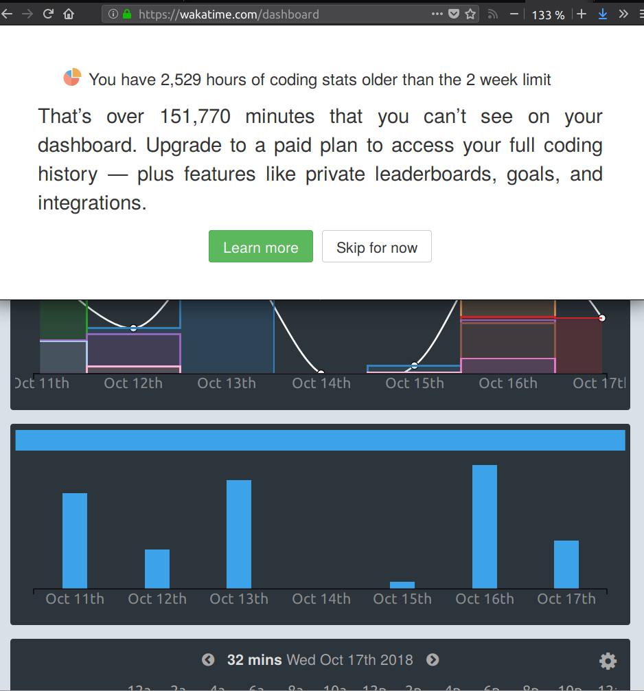

.. meta::
   :description lang=en: Why and how to use WakaTime to monitor the time you spend on programming
   :description lang=fr: Comment et pourquoi utiliser WakaTime pour surveiller le temps passé à programmer

#############################################################################
 *Why* and how to use WakaTime to monitor the time you spend on programming?
#############################################################################

What is this weird idea?
------------------------
 A professional sportive tries to monitor precisely his daily training process, including his food, which muscle she/he is working on etc.

 Well, similarly, developers and programmers might be interested to know on which projects they spend more time, on which files or directories they work on etc.

Why exactly?
------------
 Hum… in fact, the real reason seems to be pure ego: programmers are *proud* to see *how much time* they can work on each of their projects.

------------------------------------------------------------------------------

With this in mind, let me present an interesting and peculiar tool that I have been using from a while.

How can we monitor our programming time?
----------------------------------------
The goal of `WakaTime <https://wakatime.com/>`_ is to offer to any developer an easy, (relatively) *"secured"* and centralized way to monitor the time she/he spend on programming, on a daily, weekly or monthly basis.

And they do the job extremely well, because `WakaTime`_ offers three things:

 - `a very nice web interface <https://wakatime.com/>`_, well designed (responsive of course), to visualize your activity,
 - `a really rich collection <https://wakatime.com/help/getting-started/welcome>`_ of *plug-ins,* you know, these small softwares that you can easily add to `your favorite text editor <visualstudiocode.en.html>`_,
 - and `an easy way to embed some charts <https://wakatime.com/share>`_ anywhere on the web.

The concept is quite simple after: your text editor is spying on you and each aspect of your programming activity, to send the data on-line on `WakaTime`_ servers, and then you (and their sys-admins, and the NSA of course) can easily read and use your personal data.
*Scary, right?*

------------------------------------------------------------------------------

In my situation
---------------
Installation and use of WakaTime
^^^^^^^^^^^^^^^^^^^^^^^^^^^^^^^^
I was using `Sublime Text 3 <sublimetext.en.html>`_ almost exclusively for about 4 years.
Without any surprise, the `WakaTime`_ team had written a plug-in for `Sublime Text 3`.

`You can install it with two clicks <https://packagecontrol.io/packages/WakaTime>`_, and the plug-in will integrate nicely in `ST3 <sublimetext.en.html>`_ (discrete, minimal system workload, and it can even stores the data in order to send them later if your computer is temporarily disconnected from Internet).

I am now using `Visual Studio Code <visualstudiocode.fr.html>`_, and of course it also has an extension for Wakatime `which can be installed quickly <https://marketplace.visualstudio.com/items?itemName=WakaTime.vscode-wakatime>`_ too.

Overview of the statistics ?
^^^^^^^^^^^^^^^^^^^^^^^^^^^^
 During the first 8 days (after installing it, in January 2015), I was in a `coding marathon <https://bitbucket.org/lbesson/>`_ to conclude some projects (`StrapDown.js <http://lbesson.bitbucket.io/md/>`_, my `MEC Students Face-Book demo <http://perso.crans.org/besson/MEC_Students/>`_ etc), but still, I was kind of scared to see that I used my text editor for **29 hours in 8 days!**

It is also possible to see:

 - on which *project* do you spend the most of your time,
 - which *file-types* are the more used, on a daily basis,
 - and even on which *files* have you worked one (this last thing can be disabled).

For instance, during my first week of use, the repartition was about: 30% HTML, 29% Python, 15% reStructuredText, 6% Bash, 12% Markdown.

------------------------------------------------------------------------------

Sharing these statistics ?
--------------------------
Coding time over last 30 days
^^^^^^^^^^^^^^^^^^^^^^^^^^^^^
This first chart shows how much I type every day (it counts most of my emails, programming tasks and more):

.. raw:: html

   <figure><embed width="680" type="image/svg+xml" src="https://wakatime.com/@lbesson/5d1ec603-73b0-44b9-b61e-5eeda2490e51.svg"></embed></figure>

Languages over last 30 days
^^^^^^^^^^^^^^^^^^^^^^^^^^^
You can see that I mainly use `Python <learn-python.en.html>`_ and `Bash <bin.html>`_, `LaTeX <./publis/latex/>`_ and `reStructuredText <demo.html>`_, and Markdown (or HTML when using `StrapDown.js <http://lbesson.bitbucket.io/md/>`_) :

.. raw:: html

   <figure><embed width="680" type="image/svg+xml" src="https://wakatime.com/@lbesson/9f6c0b0b-6806-4afa-9a4e-651ee6201be0.svg"></embed></figure>

And from the beginning of my use of WakaTime:

.. raw:: html

   <figure><embed width="680" type="image/svg+xml" src="https://wakatime.com/@lbesson/648eaa51-38c1-47a9-9ac4-b5c434997f7e.svg"></embed></figure>

Text editors
^^^^^^^^^^^^
WakaTime thinks I only use (and it's almost correct!):
WakaTime detect that I am using the wonderful `Visual Studio Code <visualstudiocode.en.html>`_ for about ~90% of my daily writing/coding/programing, and `Sublime Text <sublimetext.html>`_
and `PyCharm IDE <https://www.jetbrains.com/pycharm/>`_ for the remaining ~10% :

.. raw:: html

   <figure><embed width="480" type="image/svg+xml" src="https://wakatime.com/@lbesson/b6e7a8c3-f9b2-46d0-b265-65adf009d58d.svg"></embed></figure>

.. note::

   WakaTime does not count `GNU Nano <NanoSyntax.html>`_, `GNU Octave GUI <http://www.gnu.org/software/octave/>`_, or `Spyder <https://pythonhosted.org/spyder/>`_ for Python 2/3.
   However, now `they offer a WakaTime plugin for Bash, Zsh and iTerm (terminal) <https://wakatime.com/help/plugins/terminal>`_!

Sharing stats for a specific project?
^^^^^^^^^^^^^^^^^^^^^^^^^^^^^^^^^^^^^
It is also possible to share the stats of one project, with a dedicated obfuscated link, like `<https://wakatime.com/@lbesson/projects/qdkkfmhcoi>`_ for example (corresponding to `that project <https://bitbucket.org/lbesson/web-sphinx/>`_).

Include a graphic of these stats here, with an iframe?
^^^^^^^^^^^^^^^^^^^^^^^^^^^^^^^^^^^^^^^^^^^^^^^^^^^^^^
Below is included that `page https://wakatime.com/@lbesson <https://wakatime.com/@lbesson>`_, with an *iframe*:

.. raw:: html

   

   <iframe src="http://wakatime.com/@lbesson" allowtransparency="true" frameborder="0" scrolling="0" width="980" height="450"></iframe>
   

.. note::

   :line:`I would love to find an easy way to just include the pie chart, and not the entire page.`
   :red:`Edit:` On December 19th (2015), I got a personal email from `Alan Hamlet <https://github.com/alanhamlett>`_, CEO and founder of WakaTime, to inform me of the new `charts share <https://wakatime.com/share>`_ feature.
   The charts displayed above are good examples of what brings this very new WakaTime feature (I find it very cool!).

`Overview of my coding time in 2015 <https://wakatime.com/a-look-back-at-2015>`_
^^^^^^^^^^^^^^^^^^^^^^^^^^^^^^^^^^^^^^^^^^^^^^^^^^^^^^^^^^^^^^^^^^^^^^^^^^^^^^^^
- About 600 hours in 2015 entirely, average for WakaTime users was 269h, median 193h (and max 2342h !).
- Daily average about 2 hours 27 minutes in 2015, average for WakaTime users was 44 min, median 31 min (and max 6 h 25 min !).
- As for languages, I mainly used `Markdown <https://wakatime.com/leaders/markdown>`_ (177 h), `LaTeX <https://wakatime.com/leaders/latex>`_ (160 h), `Python <https://wakatime.com/leaders/python>`_ (151 h) and `reStructuredText <demo.html>`_ (85 h, and `I was usually the first user of reStructuredText in WakaTime's LeaderBoard <https://wakatime.com/leaders/restructuredtext>`_ !); while other languages have less than 5h/year (`Bash <https://wakatime.com/leaders/bash>`_, `OCaml <https://wakatime.com/leaders/ocaml>`_, `Octave/Matlab <https://wakatime.com/leaders/matlab>`_, `HTML <https://wakatime.com/leaders/html>`_ / `CSS <https://wakatime.com/leaders/css>`_ etc).
- For more details, `see the screenshots in this folder (2015) <./_images/WakaTime_a_look_back_at_2015/>`_.

`Overview of my coding time in 2017 <https://wakatime.com/a-look-back-at-2017>`__
^^^^^^^^^^^^^^^^^^^^^^^^^^^^^^^^^^^^^^^^^^^^^^^^^^^^^^^^^^^^^^^^^^^^^^^^^^^^^^^^^
- Like in 2015, about 600 hours in 2017 entirely (611h), average for WakaTime users was 249h (and max 3468h !).
- Daily average about 2 hours 17 minutes in 2017, average for WakaTime users was 41 min (but the max was 9 h 30 min, this programmer is most surely a crazy dude!).
- I coded entirely under GNU/Linux (I am a big fan of XUbuntu, as always), and about 303h with `Sublime Text <sublimetext.en.html>`_, 282h with `Visual Studio Code <visualstudiocode.en.html>`_ and 45h with PyCharm. GNU Nano, Firefox and Jupyter are not counted (but `uLogMe <https://github.com/Naereen/uLogMe/>`_ tells me I don't spend much time in them anyway).
- Project wise, I coded `266h for this project for my PhD (AlgoBandits) <http://banditslilian.gforge.inria.fr/>`_, `48h pour cet article <https://hal.inria.fr/hal-01629733>`_, `41h for generic stuff about my PhD <https://perso.crans.org/besson/phd/>`_, `38h for my slideshows <https://github.com/Naereen/slides>`_, `20h for this website (and about the same time in GNU Nano) <https://bitbucket.org/lbesson/web-sphinx/>`_, `17h for my scripts and Bash configuration <https://bitbucket.org/lbesson/bin/>`_, `10h for my French cooking blog <https://perso.crans.org/besson/cuisine/>`_, `9h for my notebooks (but it doesn't count the time spent in Jupyter) <https://github.com/Naereen/notebooks>`_, and less than 8h for `all the other <https://bitbucket.org/lbesson/>`_ `projects <https://github.com/Naereen/>`_.
- As for languages, I mainly used `Python <https://wakatime.com/leaders/python>`_ (277 h), `Markdown <https://wakatime.com/leaders/markdown>`_ (107 h), `LaTeX <https://wakatime.com/leaders/latex>`_ (135 h), and `reStructuredText <demo.html>`_ (28 h); while other languages have less than 5h/year (`Bash <https://wakatime.com/leaders/bash>`_, `OCaml <https://wakatime.com/leaders/ocaml>`_, `Octave/Matlab <https://wakatime.com/leaders/matlab>`_, `HTML <https://wakatime.com/leaders/html>`_ / `CSS <https://wakatime.com/leaders/css>`_ etc).
- For more details, `see the screenshots in this folder (2017) <./_images/WakaTime_a_look_back_at_2015/>`_.

Short overview of my total coding time since 2015
^^^^^^^^^^^^^^^^^^^^^^^^^^^^^^^^^^^^^^^^^^^^^^^^^

Apparently, as of October 2018, I accumulated over 2529 hours of coding stats since 3 years and a half (January 2015).
That's a lot. In over 10+3*12=46 months, I lived about 33120 hours, and slept approximately 10000 hours. So 2500 hours of coding is about 7% of my life and about 11% of my awaken life.
I spent 11% of my life coding. That's a lot, I think (it does not count just office hours, but ALL MY LIFE since 3 years). Oh boy.

Small interlude (from `XKCD.com <https://xkcd.com/>`_)
^^^^^^^^^^^^^^^^^^^^^^^^^^^^^^^^^^^^^^^^^^^^^^^^^^^^^^
.. image::  .time_tracking_software.png
   :width:  50%
   :align:  center
   :alt:    Time-Tracking Software (https://xkcd.com/1690/)
   :target: https://xkcd.com/1690/

------------------------------------------------------------------------------

Let us finish on a bonus: read your `WakaTime`_ stats from the command line
---------------------------------------------------------------------------

It is easy to install the command line tool `WakaTimeCLI <https://github.com/JoshLankford/WakaTimeCLI/tree/master/src>`_,
with the command ``npm install wakatimecli``.

.. note:: `nodejs`_ and `npm`_ are needed.

    This requires to have already installed `nodejs <https://nodejs.org/>`_ on your machine, and its packet manager `npm <https://www.npmjs.com/>`_.

This tool is based on `the officiel WakaTime API <https://wakatime.com/developers/>`_, and should be easy to use.
The first command is `wakatime -help <https://github.com/JoshLankford/WakaTimeCLI/blob/master/src/lib/wakatime.js#L245>`_ which shows the different options that are accepted by the tool: ::

    Please pass an option:
      -? or -help
      -u or -user
      -t or -today
      -y or -yesterday
      -w or -week

The help (``wakatime -help``) is not very clear, but we can guess its use `by directly reading its source-code <https://github.com/JoshLankford/WakaTimeCLI/blob/master/src/lib/wakatime.js#L237>`_.

.. note:: This tool is writing its results with ANSI colors, sweet!

   Yeah, but it is less sweet when we see that the colors
   are used even if the output is a terminal which does not support them, or if it is a file
   (but `this is not the script's fault <https://github.com/JoshLankford/WakaTimeCLI/blob/master/src/lib/wakatime.js#L10>`_
   but `its a bug in the cli-color npm module <https://www.npmjs.com/package/cli-color#clc-strip-formatedtext>`_ that should have implemented a better detection of the output,
   like `I did for ANSIColors a few years ago <https://bitbucket.org/lbesson/ansi-colors/src/master/ANSIColors.py?fileviewer=file-view-default#ANSIColors.py-286>`_)

   As `this message explains it <http://stackoverflow.com/a/6307894>`_, this is NOT the good practice to follow.
   (`I opened an issue about that on the GitHub repo for WakaTimeCLI <https://github.com/JoshLankford/WakaTimeCLI/issues/11>`_)

   But thanks to `this sed command <http://www.commandlinefu.com/commands/view/3584/remove-color-codes-special-characters-with-sed>`_ (` | sed -r "s:\\x1B\\[[0-9;]*[mK]::g"`) I thought I would be able to include the output of a `wakatime` command in this page.

Then, in order to be able to use the tool, you will need to add `your API Key (available in the settings on WakaTime.com/settings) <https://wakatime.com/settings>`_ : ::

    wakatime -api yourApiKeyHere

For instance, the command `wakatime -w <https://github.com/JoshLankford/WakaTimeCLI/blob/master/src/lib/wakatime.js#L245>`_ gives the total time spent in your text editor(s) during the lat 7 days.

.. runblock:: console

   $ wakatime | head -n3

.. warning:: I do not know why, but this small ``wakatime`` command line tool does not work anymore on my laptop (even after uninstalling and reinstalling)… Too bad :( !

.. (c) Lilian Besson, 2011-2017, https://bitbucket.org/lbesson/web-sphinx/
