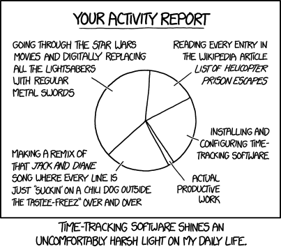

.. meta::
   :description lang=en: Why and how to use WakaTime to monitor the time you spend on programming
   :description lang=fr: Comment et pourquoi utiliser WakaTime pour surveiller le temps passé à programmer

#####################################################################################
 Pourquoi et comment utiliser WakaTime pour monitorer ses habitudes de programmation
#####################################################################################

Concept ?
---------
 Un sportif peut chercher à surveiller précisément quel entraînement il pratique quotidiennement, quel muscle il développe etc.

 Et bien, la même façon, les programmeurs et développeurs peuvent être intéressés par savoir sur quels projets ils passent le plus de temps, sur quels fichiers ou dossiers ils travaillent etc.

Pourquoi ?
----------
 Hum... en fait, la vraie raison semble purement liée à l'égo : les programmeurs sont *fiers* de voir *tout le temps* qu'il passe sur leurs projets.

------------------------------------------------------------------------------

Cette introduction étant faite, laissez-moi vous présenter un outil intéressant que j'utilise depuis quelque temps.

Comment ?
---------
Le but de `WakaTime <https://wakatime.com/>`_ est de proposer aux développeurs une façon simple, *"sécurisée"* et centralisée de surveiller le temps passé à programmer.

Et ils font ça bien, puisque `WakaTime`_ se présente sous trois formes :

 - `une interface web <https://wakatime.com/>`_, fort bien conçue, qui permet notamment de visualiser son activité,
 - `une très grande collection <https://wakatime.com/help/getting-started/welcome>`_ de *plugin*, ces petits logiciels (aussi appelés greffons) que vous pouvez facilement ajouter à votre `éditeur de texte favori <visualstudiocode.en.html>`_,
 - et `un moyen très facile d'intégrer certains graphiques <https://wakatime.com/share>`_ sur un site web, un blog Twitter, Facebook etc.

Le concept est simple : votre éditeur de texte vous espionne, envois les données en ligne sur les serveurs de `WakaTime`_, et ensuite vous (et les responsables du service, ainsi que la NSA bien-sûr) pouvez librement consulter ces données.
*Effrayant, non ?*

------------------------------------------------------------------------------

Dans mon cas
------------
Installation et utilisation de WakaTime
^^^^^^^^^^^^^^^^^^^^^^^^^^^^^^^^^^^^^^^
J'utilisais `Sublime Text 3 <sublimetext.fr.html>`_ de façon quasi exclusive durant 4 ans.
Sans surprise, `WakaTime`_ propose un greffon pour `Sublime Text 3`, mon éditeur favori.

`Il s'installe en deux clics <https://packagecontrol.io/packages/WakaTime>`_, et s'intègre à la perfection (discret, charge système minimum, et il peut même accumuler les données et les envoit plus tard si l'ordinateur est déconnecté du réseau).

J'utilise désormais `Visual Studio Code <visualstudiocode.fr.html>`_, et il y a bien sûr aussi une extension pour Wakatime `qui s'installe rapidement <https://marketplace.visualstudio.com/items?itemName=WakaTime.vscode-wakatime>`_ aussi.

Aperçus des statistiques ?
^^^^^^^^^^^^^^^^^^^^^^^^^^
Durant les 8 premiers jours (après avoir installé le greffon, en janvier 2015), j'étais en `"mode" « développement intensif » <https://bitbucket.org/lbesson/>`_ pour conclure certains projets (`StrapDown.js <http://lbesson.bitbucket.io/md/>`_, `MEC Students Face-Book demo <http://perso.crans.org/besson/MEC_Students/>`_ etc), mais j'étais tout de même un peu effrayé de voir **29h d'activité en 8 jours !**

Il est aussi possible de voir :

 - sur quels *projets* vous passez le plus de temps,
 - quels *types de fichiers* vous travaillez, jour par jour,
 - et même *quels fichiers* (cela peut être désactivé).

Par exemple, la première semaine, cela se répartissait selon : 30% HTML, 29% Python, 15% reStructuredText, 6% Bash, 12% Markdown.

------------------------------------------------------------------------------

Partager ces statistiques ?
---------------------------
Temps passé à programmer durant les 30 derniers jours
^^^^^^^^^^^^^^^^^^^^^^^^^^^^^^^^^^^^^^^^^^^^^^^^^^^^^
Ce premier graphique montre combien de temps je code chaque jour (environ) :

.. raw:: html

   <figure><embed width="680" type="image/svg+xml" src="https://wakatime.com/@lbesson/5d1ec603-73b0-44b9-b61e-5eeda2490e51.svg"></embed></figure>

Langages utilisés durant les 30 derniers jours
^^^^^^^^^^^^^^^^^^^^^^^^^^^^^^^^^^^^^^^^^^^^^^
Vous pouvez voir que j'utilise principalement `Python <apprendre-python.fr.html>`_ et `Bash <bin.html>`_, `LaTeX <./publis/latex/>`_ et `reStructuredText <demo.html>`_, et Markdown (ou HTML, si c'est une page utilisant `StrapDown.js <http://lbesson.bitbucket.io/md/>`_) :

.. raw:: html

   <figure><embed width="680" type="image/svg+xml" src="https://wakatime.com/@lbesson/9f6c0b0b-6806-4afa-9a4e-651ee6201be0.svg"></embed></figure>

Et depuis le début de mon utilisation de WakaTime :

.. raw:: html

   <figure><embed width="680" type="image/svg+xml" src="https://wakatime.com/@lbesson/648eaa51-38c1-47a9-9ac4-b5c434997f7e.svg"></embed></figure>

Éditeurs de textes utilisés
^^^^^^^^^^^^^^^^^^^^^^^^^^^
WakaTime thinks I only use (and it's almost correct!):
WakaTime détecte que j'utilise uniquement l'extraordinaire `Visual Studio Code <visualstudiocode.en.html>`_ pour environ ~90% de mon temps d'écriture et de programmation quotidien,
et `Sublime Text <sublimetext.html>`_ et `PyCharm IDE <https://www.jetbrains.com/pycharm/>`_ pour les ~10% restant :

.. raw:: html

   <figure><embed width="480" type="image/svg+xml" src="https://wakatime.com/@lbesson/b6e7a8c3-f9b2-46d0-b265-65adf009d58d.svg"></embed></figure>

.. note::

   WakaTime ne compte pas l'utilisation de `GNU Nano <NanoSyntax.html>`_, `GNU Octave GUI <http://www.gnu.org/software/octave/>`_, ou `Spyder <https://pythonhosted.org/spyder/>`_ pour Python 2/3.
   Par contre, désormais `ils proposent des greffons WakaTime pour Bash, Zsh et iTerm (terminaux) <https://wakatime.com/help/plugins/terminal>`_ !

Partager les stats d'un projet en particulier
^^^^^^^^^^^^^^^^^^^^^^^^^^^^^^^^^^^^^^^^^^^^^
Il est aussi possible de partager les statistiques d'un projet en particulier, grâce à un lien spécifique, comme `<https://wakatime.com/@lbesson/projects/qdkkfmhcoi>`_ par exemple (correspondant à `ce project <https://bitbucket.org/lbesson/web-sphinx/>`_).

Inclure un graphique via une iframe ?
^^^^^^^^^^^^^^^^^^^^^^^^^^^^^^^^^^^^^
Ci dessus est intégrée la `page https://wakatime.com/@lbesson <https://wakatime.com/@lbesson>`_ :

.. raw:: html

   

   <iframe src="https://wakatime.com/@lbesson" allowtransparency="true" frameborder="0" scrolling="0" width="980" height="450"></iframe>
   

.. note:: En attendant de faire mieux...

   :line:`J'aimerai trouver un moyen pour n'inclure que le graphique en camembert, et pas toute la page.`
   :red:`Correction :` Le 19 décembre (2015), j'ai reçu un courriel personnel de `Alan Hamlet <https://github.com/alanhamlett>`_ PDG et créateur de WakaTime, pour m'informer de la nouvelle fonctionnalité de `partage de graphiques <https://wakatime.com/share>`_ WakaTime.
   Les graphiques inclus ci-dessus sont de bons exemples de ce qu'apporte cette toute nouvelle fonctionnalité (que je trouve très cool !).

`Aperçu complet de 2015 <https://wakatime.com/a-look-back-at-2015>`_
^^^^^^^^^^^^^^^^^^^^^^^^^^^^^^^^^^^^^^^^^^^^^^^^^^^^^^^^^^^^^^^^^^^^
- Environ 600 heures en tout en 2015, alors que la moyenne des utilisateurs de WakaTime était de 269h, la médiane à 193h (mais le max à 2342h !).
- Une moyenne quotidienne de 2 heures 27 minutes en 2015, alors que la moyenne des utilisateurs de WakaTime était de 44 min, et la médiane à 31 min (mais le max à 6 h 25 min !).
- Et pour le choix de langages, j'ai surtout utilisé `Markdown <https://wakatime.com/leaders/markdown>`_ (177 h), `LaTeX <https://wakatime.com/leaders/latex>`_ (160 h), `Python <https://wakatime.com/leaders/python>`_ (151 h) et `reStructuredText <demo.html>`_ (85 h, et `je suis souvent 1er utilisateur de reStructuredText dans le tableau des utilisateurs les plus actifs sur WakaTime <https://wakatime.com/leaders/restructuredtext>`_ !); et les tous les autres langages sont à moins de 5h/an (`Bash <https://wakatime.com/leaders/bash>`_, `OCaml <https://wakatime.com/leaders/ocaml>`_, `Octave/Matlab <https://wakatime.com/leaders/matlab>`_, `HTML <https://wakatime.com/leaders/html>`_ / `CSS <https://wakatime.com/leaders/css>`_ etc).
- `Voir les captures d'écran dans ce dossier <./_images/WakaTime_a_look_back_at_2015/>`_ si besoin.

Petit interlude (de `XKCD.com <https://xkcd.com/>`_)
^^^^^^^^^^^^^^^^^^^^^^^^^^^^^^^^^^^^^^^^^^^^^^^^^^^^

------------------------------------------------------------------------------

Un bonus : accéder aux statistiques en ligne de commande
--------------------------------------------------------

Il est facile d'installer l'outil `WakaTimeCLI <https://github.com/JoshLankford/WakaTimeCLI/tree/master/src>`_,
avec la commande ``npm install wakatimecli``.

.. note:: `nodejs`_ et `npm`_ sont requis.

    Cela demande d'avoir déjà installé sur votre machine `nodejs <https://nodejs.org/>`_ et son gestionnaire de paquet `npm <https://www.npmjs.com/>`_.

Cet outil en ligne de commande se base `sur cette API <https://wakatime.com/developers/>`_, et devrait être facile à utiliser.
La première commande est `wakatime -help <https://github.com/JoshLankford/WakaTimeCLI/blob/master/src/lib/wakatime.js#L245>`_ qui montre les différentes options acceptées par cet outil : ::

    Please pass an option:
      -? or -help
      -u or -user
      -t or -today
      -y or -yesterday
      -w or -week

L'aide (``wakatime -help``) n'est pas très bien écrite, mais on peut deviner son utilisation `ici directement dans son code source <https://github.com/JoshLankford/WakaTimeCLI/blob/master/src/lib/wakatime.js#L237>`_.

.. note:: Cet outil produit une sortie en couleur, cool !

   C'est moins cool lorsqu'on s'aperçoit que les couleurs sont ne sont pas supprimée
   si la sortie est redirigée vers un terminal qui n'accepte pas les codes ANSI,
   ou un fichier (`c'est pas la faute au script <https://github.com/JoshLankford/WakaTimeCLI/blob/master/src/lib/wakatime.js#L10>`_
   mais `au module cli-color <https://www.npmjs.com/package/cli-color#clc-strip-formatedtext>`_ qui aurait du implémenter une meilleure méthode de détection,
   comme `je l'avais fait pour ANSIColors il y a quelques années <https://bitbucket.org/lbesson/ansi-colors/src/master/ANSIColors.py?fileviewer=file-view-default#ANSIColors.py-286>`_)).

   Comme l'explique `cette remarque sur stackoverflow <http://stackoverflow.com/a/6307894>`_, ce n'est pas une bonne pratique.
   (`J'ai demandé via le dépôt GitHub pour WakaTimeCLI de régler ce problème <https://github.com/JoshLankford/WakaTimeCLI/issues/11>`_)

   Merci `à cette astuce à coup de sed <http://www.commandlinefu.com/commands/view/3584/remove-color-codes-special-characters-with-sed>`_ (` | sed -r "s:\\x1B\\[[0-9;]\\*[mK]::g"`).

Ensuite, il faut ajouter `votre clé API Key (disponible dans les réglages sur WakaTime.com) <https://wakatime.com/settings>`_ : ::

    wakatime -api yourApiKeyHere

Par exemple, la commande `wakatime -w <https://github.com/JoshLankford/WakaTimeCLI/blob/master/src/lib/wakatime.js#L245>`_ donne le temps total passé sur son (ses) éditeur(s) de code durant les 7 derniers jours.

.. runblock:: console

   $ wakatime | head -n3

.. attention:: Je ne sais pas pourquoi, mais ce script ``wakatime`` en ligne de commande ne fonctionne plus sur mon ordinateur (même après une désinstallation et réinstallation).. Dommage :( !

.. (c) Lilian Besson, 2011-2017, https://bitbucket.org/lbesson/web-sphinx/
